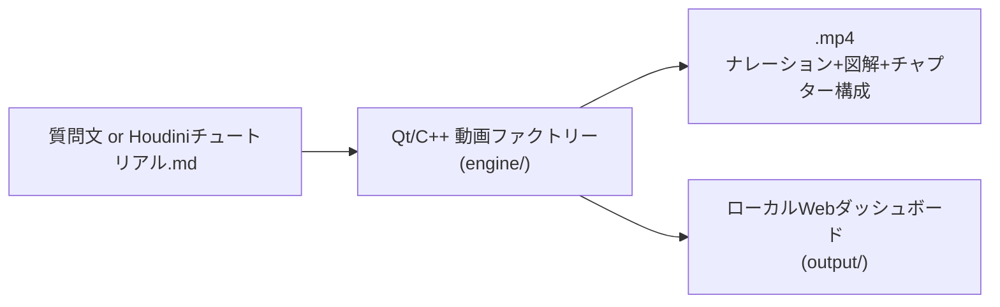

# LearningQt

Qtの学習兼各言語の比較を目的としたリポジトリです。

その学習の題材として、**RAG駆動チュートリアル動画生成ファクトリー**(Cloud RAGの知識をナレーション付き動画へ自動変換するQt/C++製ヘッドレスレンダリングエンジン)を実装しています。以下はこのファクトリーの概要・ビルド方法・動作確認手順です。

## これは何か

質問文字列(またはHoudiniで生成済みのチュートリアル`.md`)を渡すと、スライド形式・音声ナレーション付き・図解入りのチュートリアル動画(`.mp4`)を自動生成し、ローカルのWebダッシュボードに公開するツールです。



- **`video_factory_cloudrag_poc.exe`** — CLIバッチツール本体
- **`RAGReel.exe`** — 非エンジニア向けのGUIランチャー(上記exeをサブプロセスとして起動するだけの薄いラッパー)

詳しい仕組みは以下のドキュメントを参照してください。

| ドキュメント | 内容 |
|---|---|
| [docs/architecture/video-factory-design.md](docs/architecture/video-factory-design.md) | 初期アーキテクチャ設計(Phase 0)。§10に実装との乖離・追補あり |
| [docs/technical-reference.md](docs/technical-reference.md) | 実装済み内容の技術リファレンス(Mermaid図解込み)。最新の実装状況はこちらが正 |
| [lecture/video-factory-lecture.html](lecture/video-factory-lecture.html) | 講義資料(ブラウザで開いて閲覧、外部ネットワーク不要) |
| [IMPROVEMENT_PLAN.md](IMPROVEMENT_PLAN.md) | アーキテクチャ・リファクタリング計画と実施結果(Orchestrator/ScriptComposer/SceneAssembler/ServiceContainer抽出、CI導入) |

## 必要環境

- Windows 11 + Visual Studio 2022(MSVC)
- CMake 3.24+ / Ninja
- [vcpkg](https://github.com/microsoft/vcpkg)(manifestモード。`vcpkg.json`からQt6・FFmpeg・GTestを自動取得。既定では`C:/vcpkg`を想定 — 別の場所にある場合は`CMakePresets.json`の`default`プリセットの`CMAKE_TOOLCHAIN_FILE`を書き換えるか、`VCPKG_ROOT`環境変数を設定した上で`ci`プリセットを使う)
- `mermaid-cli`(`npm install -g @mermaid-js/mermaid-cli`。動画中のMermaid図解レンダリングに使用。無くてもビルド・`--mock`実行は可能で、図解はコードブロック表示にフォールバックする)

## ビルド

```powershell
cmake --preset default
cmake --build --preset default
```

初回はvcpkgがQt6/FFmpeg/GTestをソースからビルドするため、時間がかかります(環境によっては数十分)。

## 動作確認手順

### 1. 一番手軽な確認: CLIを`--mock`で動かす(APIキー不要)

```powershell
cd build\engine
.\video_factory_cloudrag_poc.exe "テストトピック" houdini21 --mock
```

- 実行が終わると同じフォルダの`output/`に動画とダッシュボードが生成されます。`output/index.html`をブラウザで直接開くか、`python -m http.server`等で配信して確認してください
- `--mock-plain`は見出しの無いプレーンな回答での動作確認用フィクスチャです
- Houdiniチュートリアルの取り込みモードも`--mock`と併用でき、ネットワーク接続なしに動作確認できます:
  ```powershell
  .\video_factory_cloudrag_poc.exe --houdini-md "<チュートリアル.mdへのパス>" --mock
  ```
  (同じ場所に同名の`.json`/`_screenshots.json`があれば自動的に使われます。無くても動きます)

### 2. GUIランチャー(RAGReel)を動かす

```powershell
cd build\engine
.\RAGReel.exe
```

起動すると「はじめに」タブが最初に表示されます。実際に動画を生成するには「設定」タブでCloud RAG URL・APIキーを入力してから「Cloud RAGクエリ」または「Houdiniチュートリアル」タブを使ってください(APIキーが無い場合はCLI側の`--mock`で確認するのが手早いです)。

### 3. 実際にCloud RAGへ接続して生成する(要APIキー)

```powershell
$env:CLOUD_RAG_URL = "https://script.google.com/macros/s/XXXX/exec"
$env:CLOUD_RAG_API_KEY = "..."

cd build\engine
.\video_factory_cloudrag_poc.exe "<質問文>" "<dbKey>"
```

### 4. 単体テストを動かす

```powershell
cd build
ctest --output-on-failure
```

`resource_budget_manager_test`(GPUリース排他制御)と`script_composer_tests`(GTest、スライド分割・Houdini解析ロジック)の2スイートが登録されています。どちらもGPU/表示デバイス不要です。

## リポジトリ構成(概略)

```
engine/
├── src/
│   ├── main_cloudrag.cpp     # 動画生成エンジンのエントリポイント
│   ├── main_launcher.cpp     # RAGReel(GUI)のエントリポイント
│   ├── orchestrator/         # GPUリース排他制御・ステージ記録
│   ├── ingest/                # スライド分割・Houdini解析(ScriptComposer)
│   ├── scene/                 # ヘッドレスQMLレンダリング(SceneAssembler)
│   ├── services/               # DI(NarrationEngine/CloudRagClient/VideoEncoder/ManifestWriter)
│   ├── encode/ narration/ ragclient/ manifest/ launcher/ common/
│   └── ...
├── qml/                        # QMLシーン・RAGReel UI
└── tests/                      # 単体テスト(GTest / フレームワーク不使用)
docs/                            # 設計書・技術リファレンス
lecture/                         # 講義資料(HTML)
```

詳細は[docs/technical-reference.md §13](docs/technical-reference.md#13-ファイル構成)を参照してください。
