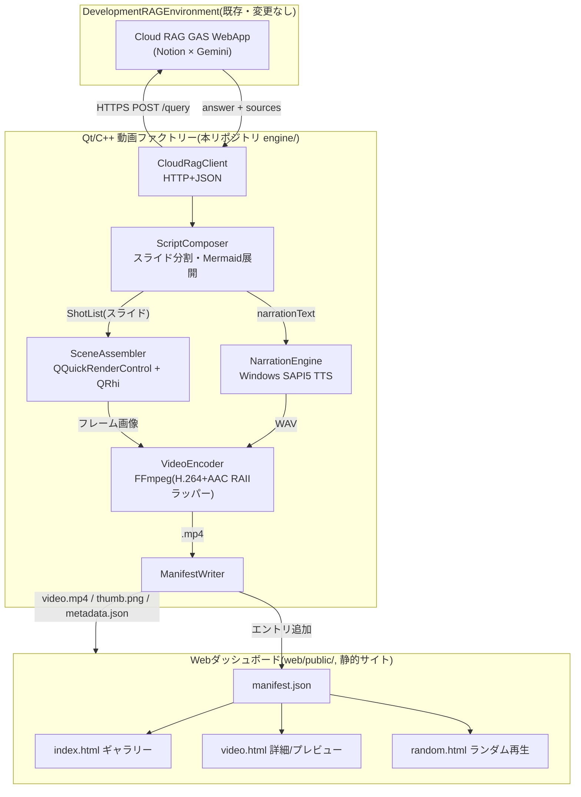
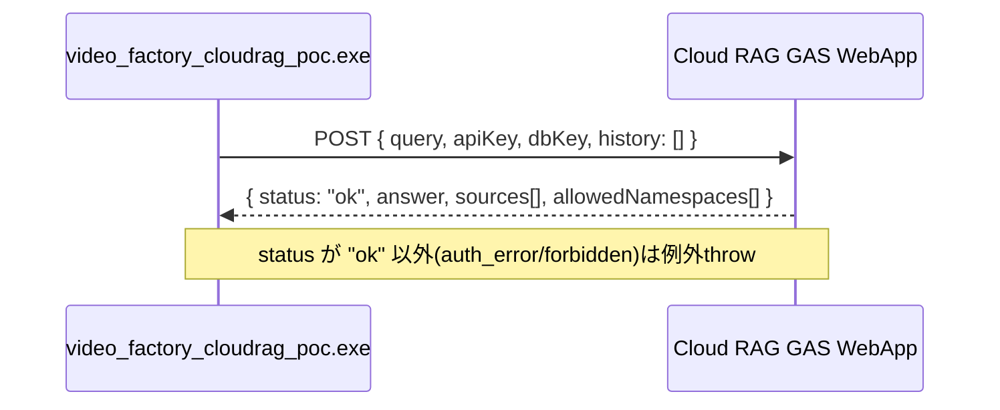
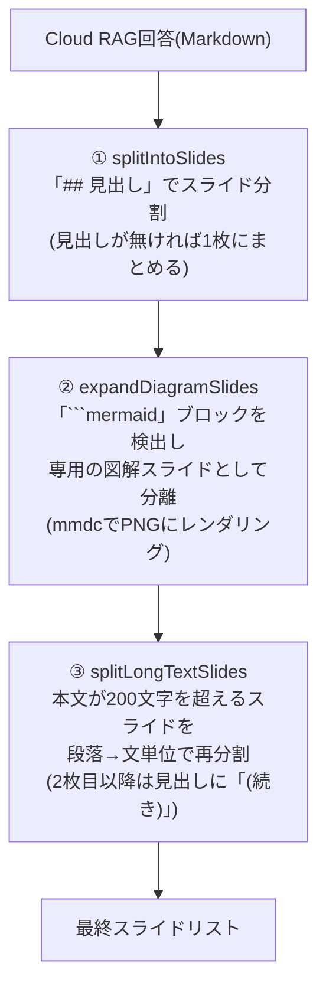
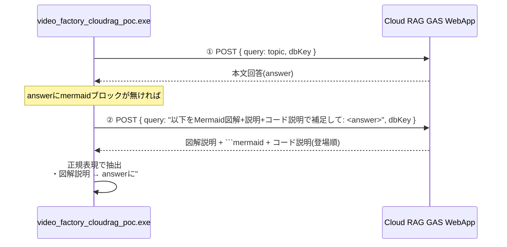
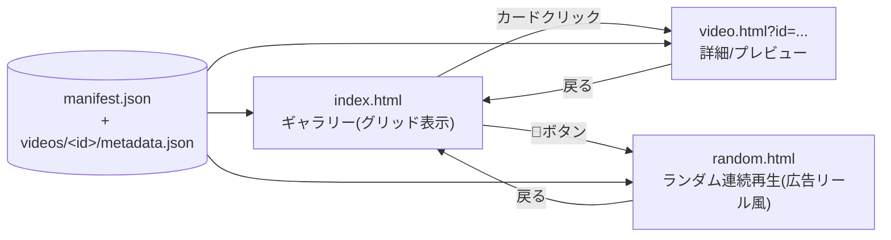

# RAG駆動チュートリアル動画生成ファクトリー — 技術資料

**対象リポジトリ:** `LearningQt`
**関連設計書:** [docs/architecture/video-factory-design.md](architecture/video-factory-design.md)(初期設計、Phase 0時点)
**本ドキュメントの位置づけ:** 実装が進んだ現時点(Phase 2.5相当)での**実装済み内容の技術リファレンス**
**更新日:** 2026-07-15

---

## 目次

1. [概要](#1-概要)
2. [システム全体アーキテクチャ](#2-システム全体アーキテクチャ)
3. [実装状況(フェーズ進捗)](#3-実装状況フェーズ進捗)
4. [Qt/C++エンジン: コンポーネント詳細](#4-qtc-エンジン-コンポーネント詳細)
5. [動画生成パイプライン](#5-動画生成パイプライン)
6. [Cloud RAG連携](#6-cloud-rag連携)
7. [ナレーション・図解の品質改善](#7-ナレーション図解の品質改善)
8. [Webダッシュボード](#8-webダッシュボード)
9. [ビルド・実行手順](#9-ビルド実行手順)
10. [実装中に判明した技術的な落とし穴](#10-実装中に判明した技術的な落とし穴)
11. [ファイル構成](#11-ファイル構成)
12. [既知の制限・今後の課題](#12-既知の制限今後の課題)

---

## 1. 概要

Cloud RAG(Notion×Gemini、`DevelopmentRAGEnvironment`)が持つ知識を、Qt/C++製のヘッドレスレンダリングエンジンで**ナレーション付きのダイジェスト動画**に自動変換し、静的Webダッシュボードで閲覧・共有できるようにするシステム。

一言で言うと: **「質問文字列を渡すと、スライド形式・音声ナレーション付き・図解入りのチュートリアル動画が自動生成され、Webギャラリーに勝手に並ぶ」ツール。**

| 項目 | 内容 |
|---|---|
| 入力 | トピック文字列 + 検索対象DB(`dbKey`) |
| 出力 | `.mp4`(H.264映像+AAC音声)+ Webダッシュボードへの自動公開 |
| 生成物の特徴 | スライド形式(見出し単位で画面が切り替わる)、SAPI音声によるナレーション、Mermaid図解、コード例の音声解説 |
| 実行形態 | CLIバッチ実行(`video_factory_cloudrag_poc.exe <topic> <dbKey>`) |

---

## 2. システム全体アーキテクチャ



**重要な設計判断(設計書§2から継続):** Faissのような専用ベクトルDBをC++側に埋め込まず、既存のCloud RAG HTTPブリッジ(GAS WebApp)をそのまま叩く。C++側はHTTPクライアントに徹する。

---

## 3. 実装状況(フェーズ進捗)

| Phase | 内容 | 状態 |
|---|---|---|
| 0 | 設計文書 + リポジトリスケルトン + `.gitignore` | ✅完了 |
| 1 | 静的QMLシーン → FFmpeg muxのヘッドレスレンダリングPoC(`video_factory_poc.exe`) | ✅完了 |
| 2 | Cloud RAG HTTPクライアント + 実際の回答から動画生成(`video_factory_cloudrag_poc.exe`) | ✅完了 |
| 2.5 | 音声ナレーション(SAPI TTS)・尺の自動調整・スライド形式・Mermaid図解・図/コードの音声解説・Webダッシュボード自動公開・ランダム再生 | ✅完了(本ドキュメントの主対象) |
| 3 | llama.cppによるローカルナレーション整形、`ResourceBudgetManager`のVRAM排他制御 | 未着手 |
| 4 | web-production-skillによるダッシュボードの本格デザイン | 部分実装(簡易デザインのみ) |
| 5 | 生成動画のRAGへの書き戻し(自己改善ループ) | 未着手 |

---

## 4. Qt/C++エンジン: コンポーネント詳細

### 4.1 実行ファイル

| 実行ファイル | 役割 |
|---|---|
| `video_factory_poc.exe` | Phase 1のPoC。固定QMLシーン(`TutorialScene.qml`)を描画してmp4化するだけ。RAG連携なし |
| `video_factory_cloudrag_poc.exe` | 本プロジェクトの本体。Cloud RAG連携・TTS・スライド分割・Mermaid図解・Webダッシュボード自動公開まで含む |

### 4.2 モジュール一覧

| モジュール | ファイル | 役割 |
|---|---|---|
| CloudRagClient | `engine/src/ragclient/cloud_rag_client.{h,cpp}` | GAS WebAppへのHTTP POSTクライアント(`QNetworkAccessManager`+`QEventLoop`による同期化) |
| NarrationEngine | `engine/src/narration/narration_engine.{h,cpp}` | Windows SAPI5によるテキスト音声合成(WAV出力) |
| VideoEncoder | `engine/src/encode/video_encoder.{h,cpp}` | libavcodec/libavformat/libswresampleのRAIIラッパー。映像(H.264)+音声(AAC)のmux |
| ManifestWriter | `engine/src/manifest/manifest_writer.{h,cpp}` | 生成物をWebダッシュボードへコピー・`manifest.json`更新 |
| main_cloudrag.cpp | `engine/src/main_cloudrag.cpp` | オーケストレーター。スライド分割・Mermaid処理・レンダリングループを統括 |
| CloudRagScene.qml | `engine/qml/CloudRagScene.qml` | データ駆動の汎用スライド表示シーン |

### 4.3 CloudRagClient



- 認証情報(`CLOUD_RAG_URL` / `CLOUD_RAG_API_KEY`)は**環境変数のみ**で受け渡し、リポジトリ・設定ファイルには一切保存しない(Unity/Houdiniクライアントと同じ方針)
- `dbKey`一覧: `all`(全DB横断) / `tool_docs` / `game_info` / `research` / `team_notes` / `afuri` / `braintq` / `fourteen` / `houdini21`

### 4.4 NarrationEngine

- Windows SAPI5(`ISpVoice`/`ISpStream`)を直接COM呼び出し(ATL/`sphelper.h`は未使用 — ATLがインストールされていない環境のため、素の`sapi.h`のみで実装)
- 44.1kHz・モノラル・16bit PCM WAVを出力
- `ISpObjectTokenCategory::EnumTokens(L"language=411", ...)` で日本語(ja-JP, LCID 0x411)ボイスを優先選択、無ければシステムデフォルトにフォールバック
- 生成されたWAVのファイルサイズから実際の音声長を逆算し、動画の尺を決定する材料にする

### 4.5 VideoEncoder(音声対応拡張)

RAII方針(設計書§4)を維持しつつ、Phase 2.5で音声トラックに対応:

| リソース | ラッパー型 |
|---|---|
| `AVFormatContext` | `AVFormatContextPtr`(カスタムデリータ`unique_ptr`) |
| `AVCodecContext`(映像/音声 各1つ) | `AVCodecContextPtr` |
| `AVFrame` | `AVFramePtr` |
| `AVPacket` | `AVPacketPtr` |
| `SwsContext`(映像スケーリング) | `SwsContextPtr` |
| `SwrContext`(音声リサンプリング) | `SwrContextPtr` |

音声パイプライン: WAVファイルをチャンク読み取り(独自の軽量RIFFパーサ) → `swr_alloc_set_opts2`でS16→AACエンコーダのsample_fmtへ変換 → ネイティブAACエンコーダでエンコード → `av_interleaved_write_frame`で映像と自動的にインターリーブ(呼び出し順序に依存せず、muxerがdtsベースで整列)。

---

## 5. 動画生成パイプライン

### 5.1 全体フロー

```mermaid
flowchart LR
    A["Cloud RAGへ質問<br/>(query)"] --> B["回答取得<br/>(answer + sources)"]
    B --> C["図解/コード説明<br/>follow-upクエリ"]
    C --> D["ナレーション文生成<br/>(Markdown→プレーンテキスト)"]
    D --> E["SAPI TTS合成<br/>(WAV + 実測長)"]
    E --> F["尺を決定<br/>(音声長+余韻)"]
    F --> G["スライド分割<br/>splitIntoSlides→expandDiagramSlides→splitLongTextSlides"]
    G --> H["フレームごとにQML<br/>プロパティ設定→レンダリング"]
    H --> I["FFmpegへpush<br/>(映像+音声mux)"]
    I --> J["ManifestWriter<br/>Webダッシュボードへ公開"]
```



### 5.2 スライド分割ロジック(3段階)

「回答は`##`見出しがあるとは限らない」「1セクションが長すぎるとスクロールに頼りきりになる」という2つの実問題に対応するため、3段階のパイプラインになっている。



この3段構成により、**見出しの有無にかかわらず必ずダイジェスト(スライド)形式になる**ことを保証している(以前は見出しが無い回答が1枚の全スクロール動画になってしまうバグがあったため、③を追加して修正した)。

### 5.3 スライドの時間配分

各スライドの表示時間は本文の文字数に比例配分(最低文字数フロアあり)。`computeSlideStartFrames()`が文字数の重み付けからフレーム境界のルックアップテーブルを構築し、レンダリングループが現在のフレームがどのスライドに属するかを判定してQMLへプロパティ(`slideHeading`/`slideBody`/`slideProgress`等)を渡す。

---

## 6. Cloud RAG連携

### 6.1 図解生成の仕組み

実際のCloud RAG回答(Gemini生成)には`\`\`\`mermaid`ブロックがほぼ含まれない(GAS側のプロンプトが図解生成を指示していないため)。これに対応するため、LearningQt側だけで完結する追加クエリ機構を実装した。



この機構により、DevelopmentRAGEnvironment側(GASプロンプト)には一切変更を加えずに図解機能を実現している。

### 6.2 図解・コードの音声説明

以前は図解・コードブロックに差し掛かると、ナレーションが「(図解は画面をご覧ください。)」「(コード例は画面をご覧ください。)」という汎用フレーズになり説明が無いに等しかった。上記の追加クエリで取得した実際の説明文を使うよう修正:

- **図解の説明**: `## 図解`セクションの本文(見出しの下・図の直前)としてMarkdownに合成 → 既存のスライド分割ロジックが自動的に「説明文スライド→図解スライド」の2枚に分け、説明文は通常のプレーンテキストとして自然にナレーションされる
- **コードの説明**: `stripMarkdownForNarration()`が本文中の各コードフェンスを検出順に走査し、対応する説明文(follow-upクエリで取得した配列を順番に消費)に置き換える。取得できなかった分は汎用フレーズにフォールバック

---

## 7. ナレーション・図解の品質改善

| 改善項目 | Before | After |
|---|---|---|
| フォーマット | 1枚のカードに全文を流し込みスクロール | 見出し単位のスライド + フェード遷移 + スライドカウンター表示 |
| 尺 | 固定6秒 | 実際のTTS音声長に応じて自動調整(最低4秒+余韻1.5秒) |
| フォント/配色 | 簡易的な単色 | Yu Gothic UI・上部プログレスバー・カードパネル・グラデーション背景 |
| 図解 | ほぼ発生しない(モックのみ) | follow-upクエリで実質確実に生成 |
| 図解/コードの説明 | 「画面をご覧ください」の一言 | 実際の内容説明(follow-upクエリで取得) |
| 出力ファイル名 | 固定名(再実行で上書き・混同) | 実行ごとにタイムスタンプ付きでユニーク化 |

---

## 8. Webダッシュボード

### 8.1 ページ構成



- **静的サイトのみ、バックエンド無し**(設計書§5の方針を継続)。`fetch()`でJSONを読み込むだけなので、ローカルHTTPサーバー(`python -m http.server`等)での配信が必要(`file://`直接オープンはCORSで失敗する)
- **video.html**: 埋め込み動画プレイヤー、RAG出典一覧、「生成プロセス」の振り返り表示(実測タイミング付きパイプラインカード)、再生成コマンドのコピーボタン(v1では実行トリガーにはしない)
- **random.html**: シャッフル+自動連続再生。ミュート状態でオートプレイ開始(ブラウザの自動再生制限対策)、視聴終了で自動的に次の動画へ、全部見終わったら再シャッフルして無限ループ

### 8.2 manifest.jsonスキーマ

```jsonc
// manifest.json — 集約インデックス(新しい順)
[
  {
    "id": "cloudrag_20260714_192246",
    "slug": "cloudrag_20260714_192246",
    "title": "string",
    "created_at": "ISO8601",
    "duration_sec": 84.4,
    "video_path": "videos/<id>/video.mp4",
    "thumbnail_path": "videos/<id>/thumb.png",
    "tags": ["<dbKey>", "cloud-rag"],
    "status": "done",
    "source_tutorial": "cloud-rag:<dbKey>"
  }
]
```

```jsonc
// videos/<id>/metadata.json
{
  "narration_summary": "string",
  "rag_sources": [{ "file": "string", "namespace": "string", "similarity": 0.0, "excerpt": "" }],
  "pipeline": [
    { "stage": "ingest", "label": "取り込み", "status": "done", "duration_sec": 0.0 },
    { "stage": "compose", "label": "構成 (スライド分割)", "status": "done", "duration_sec": 0.0 },
    { "stage": "narrate", "label": "ナレーション (SAPI TTS)", "status": "done", "duration_sec": 0.0 },
    { "stage": "render", "label": "レンダリング+エンコード", "status": "done", "duration_sec": 0.0 },
    { "stage": "publish", "label": "公開", "status": "done", "duration_sec": 0.0 }
  ]
}
```

`pipeline`の各`duration_sec`は`QElapsedTimer`による**実測値**(設計時のプレースホルダーではない)。

### 8.3 ManifestWriter の自動公開フロー

動画生成が成功すると、`ManifestWriter::publish()`が以下を自動実行する(手動コピー不要):

1. `web/public/videos/<id>/`ディレクトリを作成
2. 生成したmp4をコピー
3. レンダリング中(全体の40%地点)のフレームをサムネイルとしてPNG保存(JPEGは追加プラグイン配置が必要なため回避)
4. `metadata.json`を書き出し
5. `manifest.json`を読み込み、**既存エントリを保持したまま**新エントリを先頭に追加して書き戻し

---

## 9. ビルド・実行手順

### 9.1 トールチェーン

- CMake + Ninja + MSVC(Visual Studio 2022)
- vcpkg(manifestモード、`vcpkg.json`)経由でQt6(qtbase/qtdeclarative)・FFmpeg(x264/AAC込み)を取得
- `mermaid-cli`(npmグローバルパッケージ `@mermaid-js/mermaid-cli`)を図解レンダリングに使用

```powershell
cmake --preset default
cmake --build --preset default
```

### 9.2 実行

```powershell
$env:CLOUD_RAG_URL = "https://script.google.com/macros/s/XXXX/exec"
$env:CLOUD_RAG_API_KEY = "..."

cd build\engine
.\video_factory_cloudrag_poc.exe "<質問文>" "<dbKey>"
```

- `--mock` / `--mock-plain`フラグでAPIキー無しにサンプルデータで動作確認可能(開発用)
- 実行後、`web/public/`配下に自動公開されるので、`python -m http.server`等で`web/public`を配信して確認する

---

## 10. 実装中に判明した技術的な落とし穴

開発中に踏んだ問題とその対処をまとめる(同じ問題を再度踏まないためのメモ)。

| 問題 | 原因 | 対処 |
|---|---|---|
| `QQuickRenderControl::initialize()`が失敗する | `QT_QPA_PLATFORM=offscreen`はD3D11コンテキストを作れない | デフォルトの`windows`プラットフォームのまま使う(ウィンドウは表示されない) |
| 実行時に何も表示されず即終了 | Qtの`platforms/`プラグインフォルダが実行ファイルと同じ場所に無い | CMakeのPOST_BUILDでプラグインディレクトリを自動コピー |
| `qt.network.ssl: No functional TLS backend was found` | `tls/`プラグイン(qopensslbackend.dll)と`libssl-3-x64.dll`が未配置 | 同上の仕組みで`tls/`もコピー、libsslも明示的にコピー |
| サムネイル保存が失敗する | JPEGはQtの実行時プラグイン(`imageformats/qjpeg.dll`)が必要で未配置 | PNG形式に変更(QtGuiに標準搭載、プラグイン不要) |
| `qDebug()`/`qCritical()`の出力が全く見えない | このコンソールサブシステムexeをリダイレクト付きで起動すると、Qtの既定メッセージハンドラがstderrに届かないことがある | `std::fprintf(stderr, ...)`を直接使う |
| トピックを変えて再実行しても古い動画に見える | 出力ファイル名が固定(`phase2_cloudrag_poc.mp4`)で毎回上書きされていた | 実行時刻ベースの`runId`を全生成物のファイル名に付与 |
| 見出しの無い回答が全スクロール動画になる | `splitIntoSlides`は見出しが無いと1枚の巨大スライドにフォールバックしていた | `splitLongTextSlides`で段落/文単位の強制再分割を追加 |

---

## 11. ファイル構成

```
LearningQt/
├── docs/
│   ├── architecture/video-factory-design.md   # 初期設計書(Phase 0)
│   └── technical-reference.md                  # 本ドキュメント
├── lecture/
│   └── video-factory-lecture.html               # 講義資料(HTML)
├── engine/
│   ├── CMakeLists.txt
│   ├── assets/mermaid_theme.json                # Mermaidブランドカラーテーマ
│   ├── qml/
│   │   ├── TutorialScene.qml                    # Phase 1 PoC用
│   │   └── CloudRagScene.qml                    # スライドデッキ本体
│   └── src/
│       ├── main.cpp                             # Phase 1 エントリポイント
│       ├── main_cloudrag.cpp                    # Phase 2.5 エントリポイント(本体)
│       ├── encode/video_encoder.{h,cpp}
│       ├── narration/narration_engine.{h,cpp}
│       ├── ragclient/cloud_rag_client.{h,cpp}
│       └── manifest/manifest_writer.{h,cpp}
├── web/public/
│   ├── index.html / video.html / random.html
│   ├── styles.css / app.js
│   ├── manifest.json
│   └── videos/<id>/{video.mp4, thumb.png, metadata.json}
├── vcpkg.json / CMakePresets.json / CMakeLists.txt
└── .gitignore
```

---

## 12. 既知の制限・今後の課題

- **Phase 3(VRAM排他制御)は未着手**: 現状llama.cppによるナレーション整形は導入しておらず、`ResourceBudgetManager`によるGPUリース排他制御も未実装。TTSはWindows標準SAPIで完結しているため、当面のVRAM競合リスクは低い
- **Webダッシュボードは簡易デザインのまま**: web-production-skillによる本格的なデザイン工程(Phase 4)は未実施。現状は実装者が直接CSSを書いた最小限のスタイル
- **自己改善ループ未実装**: 生成動画のトランスクリプトをRAGへ書き戻す仕組み(設計書§6)は未着手
- **図解follow-upクエリの品質はGemini依存**: プロンプトで指定した出力フォーマット(「図解説明: 」「コード説明: 」)にGeminiが従わない場合、それぞれ安全にフォールバックするが、フォールバック時は品質が元に戻る
- **manifest.json / metadata.jsonの信頼性**: 複数プロセスが同時に動画生成→公開を行うと、`manifest.json`の読み込み→書き込みの間にレースコンディションが起きうる(現状は単一プロセス・逐次実行を前提とした設計)
