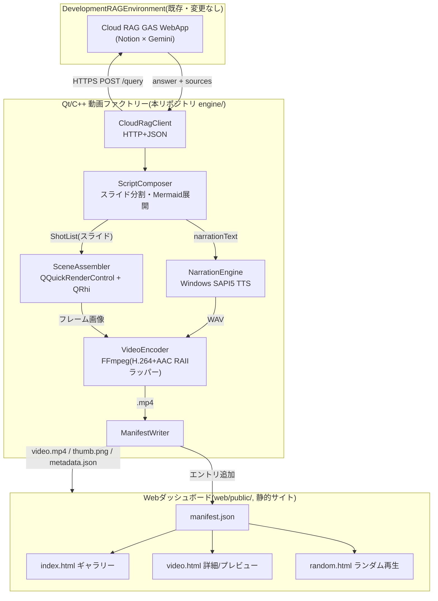
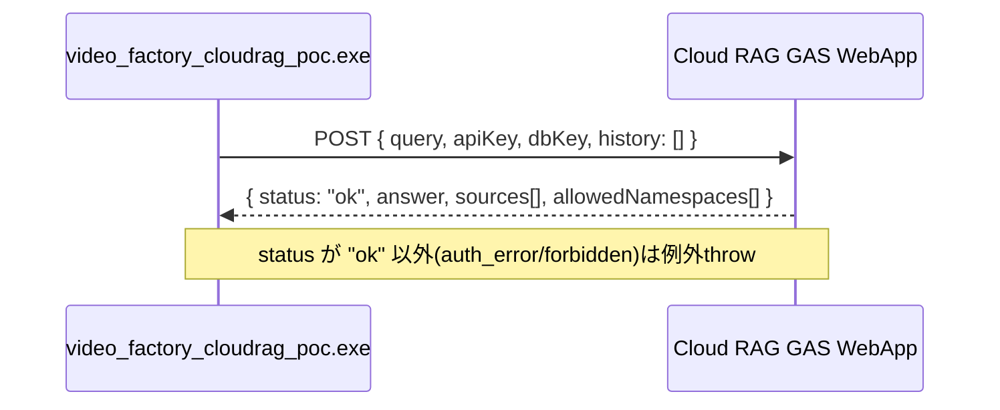
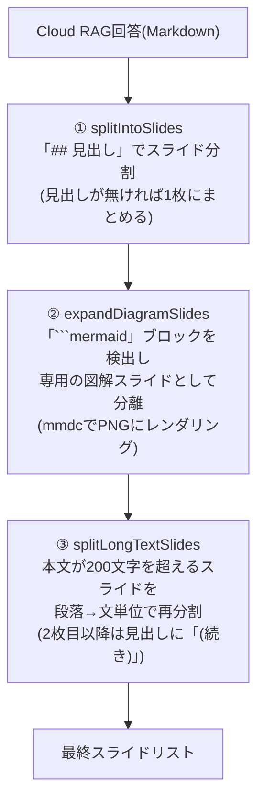
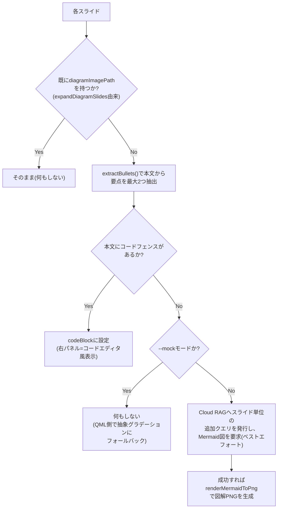
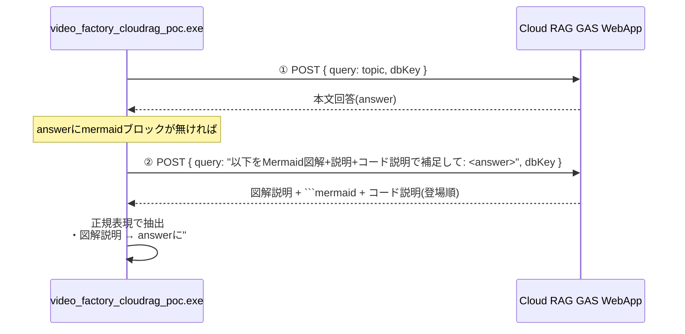
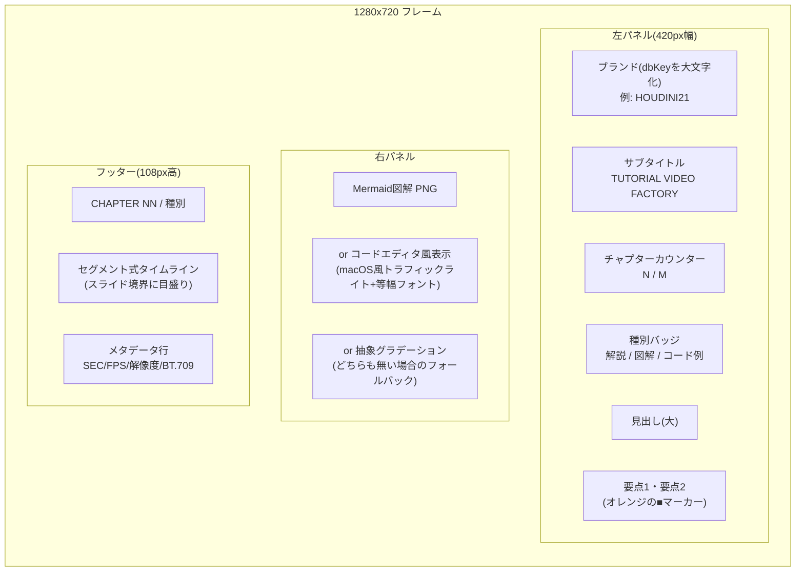
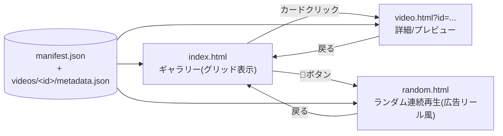
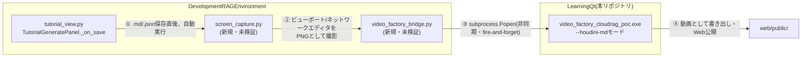

# RAG駆動チュートリアル動画生成ファクトリー — 技術資料

**対象リポジトリ:** `LearningQt`
**関連設計書:** [docs/architecture/video-factory-design.md](architecture/video-factory-design.md)(初期設計、Phase 0時点)
**本ドキュメントの位置づけ:** 実装が進んだ現時点(Phase 2.6相当)での**実装済み内容の技術リファレンス**
**更新日:** 2026-07-22

---

## 目次

1. [概要](#1-概要)
2. [システム全体アーキテクチャ](#2-システム全体アーキテクチャ)
3. [実装状況(フェーズ進捗)](#3-実装状況フェーズ進捗)
4. [Qt/C++エンジン: コンポーネント詳細](#4-qtc-エンジン-コンポーネント詳細)
5. [動画生成パイプライン](#5-動画生成パイプライン)
6. [Cloud RAG連携](#6-cloud-rag連携)
7. [映像レイアウト: 分割画面チャプター形式(KISARAGIスタイル)](#7-映像レイアウト-分割画面チャプター形式kisaragiスタイル)
8. [ナレーション・図解の品質改善](#8-ナレーション図解の品質改善)
9. [実データ運用で発覚した品質バグと修正](#9-実データ運用で発覚した品質バグと修正)
10. [Webダッシュボード](#10-webダッシュボード)
11. [ビルド・実行手順](#11-ビルド実行手順)
12. [実装中に判明した技術的な落とし穴](#12-実装中に判明した技術的な落とし穴)
13. [ファイル構成](#13-ファイル構成)
14. [既知の制限・今後の課題](#14-既知の制限今後の課題)
15. [次フェーズの方向性: Houdini実画面レンダリング連携](#15-次フェーズの方向性-houdini実画面レンダリング連携)

---

## 1. 概要

Cloud RAG(Notion×Gemini、`DevelopmentRAGEnvironment`)が持つ知識を、Qt/C++製のヘッドレスレンダリングエンジンで**ナレーション付きのダイジェスト動画**に自動変換し、静的Webダッシュボードで閲覧・共有できるようにするシステム。

一言で言うと: **「質問文字列を渡すと、スライド形式・音声ナレーション付き・図解入りのチュートリアル動画が自動生成され、Webギャラリーに勝手に並ぶ」ツール。**

| 項目 | 内容 |
|---|---|
| 入力 | トピック文字列 + 検索対象DB(`dbKey`) |
| 出力 | `.mp4`(H.264映像+AAC音声)+ Webダッシュボードへの自動公開 |
| 生成物の特徴 | 分割画面のチャプター形式(左:見出し・要点2つ / 右:図解 or コード / 下部:セグメント式タイムライン)、SAPI音声によるナレーション、スライドごとのMermaid図解、コード例の音声解説 |
| 実行形態 | CLIバッチ実行(`video_factory_cloudrag_poc.exe <topic> <dbKey>`) |

---

## 2. システム全体アーキテクチャ



**重要な設計判断(設計書§2から継続):** Faissのような専用ベクトルDBをC++側に埋め込まず、既存のCloud RAG HTTPブリッジ(GAS WebApp)をそのまま叩く。C++側はHTTPクライアントに徹する。

---

## 3. 実装状況(フェーズ進捗)

| Phase | 内容 | 状態 |
|---|---|---|
| 0 | 設計文書 + リポジトリスケルトン + `.gitignore` | ✅完了 |
| 1 | 静的QMLシーン → FFmpeg muxのヘッドレスレンダリングPoC(`video_factory_poc.exe`) | ✅完了 |
| 2 | Cloud RAG HTTPクライアント + 実際の回答から動画生成(`video_factory_cloudrag_poc.exe`) | ✅完了 |
| 2.5 | 音声ナレーション(SAPI TTS)・尺の自動調整・スライド形式・Mermaid図解・図/コードの音声解説・Webダッシュボード自動公開・ランダム再生 | ✅完了 |
| 2.6 | 分割画面チャプター形式(KISARAGIスタイル)への映像レイアウト刷新、スライドごとの個別Mermaid図解生成(`enrichSlidesForDisplay`)、実データ運用で発覚した品質バグ2件の修正(要点重複・図解への出典番号混入) | ✅完了(本ドキュメントの主対象) |
| 3 | llama.cppによるローカルナレーション整形、`ResourceBudgetManager`のVRAM排他制御 | 未着手 |
| 4 | web-production-skillによるダッシュボードの本格デザイン | 部分実装(簡易デザインのみ) |
| 5 | 生成動画のRAGへの書き戻し(自己改善ループ) | 未着手 |
| 6 | Houdini実画面レンダリングとの連携(`DevelopmentRAGEnvironment`のHoudiniチュートリアル生成から本システムを呼び出し) | LearningQt側は実装・検証済み / Houdini側は実装済みだが実機未検証(§15参照) |

---

## 4. Qt/C++エンジン: コンポーネント詳細

### 4.1 実行ファイル

| 実行ファイル | 役割 |
|---|---|
| `video_factory_poc.exe` | Phase 1のPoC。固定QMLシーン(`TutorialScene.qml`)を描画してmp4化するだけ。RAG連携なし |
| `video_factory_cloudrag_poc.exe` | 本プロジェクトの本体。Cloud RAG連携・TTS・スライド分割・Mermaid図解・Webダッシュボード自動公開まで含む |

### 4.2 モジュール一覧

| モジュール | ファイル | 役割 |
|---|---|---|
| CloudRagClient | `engine/src/ragclient/cloud_rag_client.{h,cpp}` | GAS WebAppへのHTTP POSTクライアント(`QNetworkAccessManager`+`QEventLoop`による同期化) |
| NarrationEngine | `engine/src/narration/narration_engine.{h,cpp}` | Windows SAPI5によるテキスト音声合成(WAV出力) |
| VideoEncoder | `engine/src/encode/video_encoder.{h,cpp}` | libavcodec/libavformat/libswresampleのRAIIラッパー。映像(H.264)+音声(AAC)のmux |
| ManifestWriter | `engine/src/manifest/manifest_writer.{h,cpp}` | 生成物をWebダッシュボードへコピー・`manifest.json`更新 |
| main_cloudrag.cpp | `engine/src/main_cloudrag.cpp` | オーケストレーター。スライド分割・Mermaid処理・レンダリングループを統括 |
| CloudRagScene.qml | `engine/qml/CloudRagScene.qml` | データ駆動の分割画面(左情報パネル+右ビジュアルパネル+フッタータイムライン)シーン。詳細は§7 |

### 4.3 CloudRagClient



- 認証情報(`CLOUD_RAG_URL` / `CLOUD_RAG_API_KEY`)は**環境変数のみ**で受け渡し、リポジトリ・設定ファイルには一切保存しない(Unity/Houdiniクライアントと同じ方針)
- `dbKey`一覧: `all`(全DB横断) / `tool_docs` / `game_info` / `research` / `team_notes` / `afuri` / `braintq` / `fourteen` / `houdini21`

### 4.4 NarrationEngine

- Windows SAPI5(`ISpVoice`/`ISpStream`)を直接COM呼び出し(ATL/`sphelper.h`は未使用 — ATLがインストールされていない環境のため、素の`sapi.h`のみで実装)
- 44.1kHz・モノラル・16bit PCM WAVを出力
- `ISpObjectTokenCategory::EnumTokens(L"language=411", ...)` で日本語(ja-JP, LCID 0x411)ボイスを優先選択、無ければシステムデフォルトにフォールバック
- 生成されたWAVのファイルサイズから実際の音声長を逆算し、動画の尺を決定する材料にする

### 4.5 VideoEncoder(音声対応拡張)

RAII方針(設計書§4)を維持しつつ、Phase 2.5で音声トラックに対応:

| リソース | ラッパー型 |
|---|---|
| `AVFormatContext` | `AVFormatContextPtr`(カスタムデリータ`unique_ptr`) |
| `AVCodecContext`(映像/音声 各1つ) | `AVCodecContextPtr` |
| `AVFrame` | `AVFramePtr` |
| `AVPacket` | `AVPacketPtr` |
| `SwsContext`(映像スケーリング) | `SwsContextPtr` |
| `SwrContext`(音声リサンプリング) | `SwrContextPtr` |

音声パイプライン: WAVファイルをチャンク読み取り(独自の軽量RIFFパーサ) → `swr_alloc_set_opts2`でS16→AACエンコーダのsample_fmtへ変換 → ネイティブAACエンコーダでエンコード → `av_interleaved_write_frame`で映像と自動的にインターリーブ(呼び出し順序に依存せず、muxerがdtsベースで整列)。

---

## 5. 動画生成パイプライン

### 5.1 全体フロー

```mermaid
flowchart LR
    A["Cloud RAGへ質問<br/>(query)"] --> B["回答取得<br/>(answer + sources)"]
    B --> C["図解/コード説明<br/>follow-upクエリ"]
    C --> D["ナレーション文生成<br/>(Markdown→プレーンテキスト)"]
    D --> E["SAPI TTS合成<br/>(WAV + 実測長)"]
    E --> F["尺を決定<br/>(音声長+余韻)"]
    F --> G["スライド分割<br/>splitIntoSlides→expandDiagramSlides→splitLongTextSlides"]
    G --> G2["表示情報の付加<br/>enrichSlidesForDisplay<br/>(要点2つ抽出/コード検出/スライド単位の図解follow-up)"]
    G2 --> H["フレームごとにQML<br/>プロパティ設定→レンダリング"]
    H --> I["FFmpegへpush<br/>(映像+音声mux)"]
    I --> J["ManifestWriter<br/>Webダッシュボードへ公開"]
```



### 5.2 スライド分割ロジック(3段階)

「回答は`##`見出しがあるとは限らない」「1セクションが長すぎるとスクロールに頼りきりになる」という2つの実問題に対応するため、3段階のパイプラインになっている。



この3段構成により、**見出しの有無にかかわらず必ずダイジェスト(スライド)形式になる**ことを保証している(以前は見出しが無い回答が1枚の全スクロール動画になってしまうバグがあったため、③を追加して修正した)。

### 5.3 スライドの時間配分

各スライドの表示時間は本文の文字数に比例配分(最低文字数フロアあり)。`computeSlideStartFrames()`が文字数の重み付けからフレーム境界のルックアップテーブルを構築し、レンダリングループが現在のフレームがどのスライドに属するかを判定してQMLへプロパティ(`slideHeading`/`slideBullet1`/`slideBullet2`/`slideProgress`等)を渡す。

### 5.4 enrichSlidesForDisplay(表示情報の付加)

Phase 2.6の分割画面レイアウト(§7)では、スライド本文をそのまま画面に流し込まない(ナレーションでのみ読み上げる)。代わりに各スライドについて、画面表示用の情報を1枚ずつ組み立てる:



このスライド単位クエリはベストエフォートで、失敗しても例外を握りつぶしてそのスライドをスキップするだけ(1スライドの図解生成失敗が動画全体を止めない)。

---

## 6. Cloud RAG連携

### 6.1 図解生成の仕組み

実際のCloud RAG回答(Gemini生成)には`\`\`\`mermaid`ブロックがほぼ含まれない(GAS側のプロンプトが図解生成を指示していないため)。これに対応するため、LearningQt側だけで完結する追加クエリ機構を実装した。



この機構により、DevelopmentRAGEnvironment側(GASプロンプト)には一切変更を加えずに図解機能を実現している。

### 6.2 図解・コードの音声説明

以前は図解・コードブロックに差し掛かると、ナレーションが「(図解は画面をご覧ください。)」「(コード例は画面をご覧ください。)」という汎用フレーズになり説明が無いに等しかった。上記の追加クエリで取得した実際の説明文を使うよう修正:

- **図解の説明**: `## 図解`セクションの本文(見出しの下・図の直前)としてMarkdownに合成 → 既存のスライド分割ロジックが自動的に「説明文スライド→図解スライド」の2枚に分け、説明文は通常のプレーンテキストとして自然にナレーションされる
- **コードの説明**: `stripMarkdownForNarration()`が本文中の各コードフェンスを検出順に走査し、対応する説明文(follow-upクエリで取得した配列を順番に消費)に置き換える。取得できなかった分は汎用フレーズにフォールバック

---

## 7. 映像レイアウト: 分割画面チャプター形式(KISARAGIスタイル)

Phase 2.6でユーザーが提示したプロ品質の製品紹介動画(左:情報パネル、右:大きなビジュアル、下部:チャプタータイムライン)を参考に、`CloudRagScene.qml`を全面刷新した。以前の「1枚のカードに全文スクロール」形式から、チャプターごとに画面が切り替わる分割画面レイアウトへ移行している。



**設計判断(ユーザーとの確認済み事項):**

| 論点 | 決定 | 理由 |
|---|---|---|
| ブランドラベル | `dbKey`を大文字化してそのまま表示(例: `houdini21`→`HOUDINI21`) | 固定の製品ブランド名の代わりに、参照元DBを可視化する意味も兼ねる |
| キャプション言語 | 日本語のみ、英語併記なし | シンプルさを優先。対象動画は日本語ナレーションが前提のため |
| 右パネルのビジュアル | ハイブリッド方式: コードスライドはコードエディタ風モックアップ、平文スライドはスライド単位のMermaid図解、どちらも無ければ抽象グラデーション | 「実際の画面」に近い情報密度を、実装コストを抑えつつ実現(Houdini実画面キャプチャは§15の次フェーズ課題) |

本文テキストはもはや画面に直接表示しない(ナレーションでのみ読み上げる)。画面には要点2つ(`extractBullets()`が抽出)だけを表示し、「一目で分かる」情報量に絞っている。スライド境界での遷移は`slideProgress`に基づくフェードイン/アウト(最初/最後の12%区間)で、チャプター切り替えが唐突にならないようにしている。

---

## 8. ナレーション・図解の品質改善

| 改善項目 | Before | After |
|---|---|---|
| フォーマット | 1枚のカードに全文を流し込みスクロール | 見出し単位のスライド + フェード遷移 + スライドカウンター表示 |
| 尺 | 固定6秒 | 実際のTTS音声長に応じて自動調整(最低4秒+余韻1.5秒) |
| フォント/配色 | 簡易的な単色 | Yu Gothic UI・上部プログレスバー・カードパネル・グラデーション背景 |
| 図解 | ほぼ発生しない(モックのみ) | follow-upクエリで実質確実に生成 |
| 図解/コードの説明 | 「画面をご覧ください」の一言 | 実際の内容説明(follow-upクエリで取得) |
| 出力ファイル名 | 固定名(再実行で上書き・混同) | 実行ごとにタイムスタンプ付きでユニーク化 |

---

## 9. 実データ運用で発覚した品質バグと修正

Phase 2.6のレイアウト刷新後、`--mock`ではなく実際のCloud RAG認証情報・実データ(トピック「花火のパーティクルの作り方について教えてください」、`dbKey=houdini21`)で生成した動画をユーザーが確認したところ、`--mock`のテスト内容だけでは表面化しなかった2件の品質バグが見つかった。

### 9.1 要点の重複

**症状:** 左パネルの要点1・要点2に、同一内容がほぼそのまま2回表示される。しかも2回目には先頭に`- `という生のMarkdownリストマーカーが残っていた。

**原因:** `extractBullets()`は「①`-`/`*`始まりの行を正規表現で拾う」→「①で2件集まらなければ、本文全体を文単位に分割してフォールバック補完する」という2段階構成だった。本文にリスト項目が1件しか無い場合、①で1件確保した後、②のフォールバックが**同じ本文全体を再スキャン**するため、①で既に拾った文がそのまま「新しい文」として再度ヒットしていた。さらに②のフォールバック側は先頭の`- `/`* `マーカーを除去する処理が無かったため、リストマーカー付きのまま重複表示されていた。

**修正:** `engine/src/main_cloudrag.cpp`の`extractBullets()`に、正規化した内容(先頭マーカー除去+空白除去)をキーにした重複排除ステップを追加。①・②どちらの経路で拾った候補も、既に採用済みの内容と正規化後に一致すればスキップする。あわせて②のフォールバック側にも`^[-*]\s+`除去を追加し、そもそもマーカー付きで拾わないようにした。

### 9.2 図解への出典番号混入

**症状:** Mermaid図解に、本来の内容とは無関係な孤立した`1`だけのノードなどが混入する。

**原因:** Cloud RAGの回答本文には`[1]`や`[4]`のような出典番号が付与される。この本文をそのままMermaid図解生成プロンプトに埋め込んでいたため、生成された図解のノードラベルに出典番号が紛れ込むケースがあった。さらに厄介なことに、Mermaid記法そのものが`[...]`を四角形ノードの構文として解釈するため、番号だけが単独ノードとして誤描画される事故が起きていた。

**修正:** 出典番号除去用の共通ヘルパー`stripCitationMarkers()`(正規表現`\[\d+\]`)を新設し、以下の3箇所で図解生成プロンプトに渡す直前に適用するよう修正:

1. `enrichSlidesForDisplay()`のスライド単位図解クエリ(見出し・本文の両方)
2. メインの図解+コード説明follow-upクエリの入力(`response.answer`全体)
3. follow-upクエリの返答から抽出した図解キャプション・Mermaidブロック自体(モデルが出典番号を復唱してくる場合への保険)

ナレーション用の`stripMarkdownForNarration()`も同じヘルパーを使うよう統一し、実装の重複を解消した。

### 9.3 検証方法(1回目)

`--mock`フィクスチャ(`mockResponse()`)は元々出典番号`[1][2]`を含む文面を持つため、この2件のバグを再現できる。修正後にビルドし直し、`--mock`で動画を再生成、`ffmpeg`でフレームを間引き抽出して目視確認: 要点の重複・生のリストマーカー残存・図解への孤立ノード混入のいずれも解消されていることを確認済み。

### 9.4 実データ第2ラウンド: 残っていた3件

上記9.1/9.2の修正後、ユーザーが実際に`"花火のパーティクルの作り方について教えてください" houdini21`で再実行したところ、`--mock`のテストパターンでは想定していなかった3件がさらに見つかった。

**① 要点の「先頭だけ重複」(9.1の修正で防げなかった別パターン)**

- **症状:** 1つの箇条書き行が「文A。-  文B。」のように複数の文を含む場合、要点1にはその行全体(文A+文B)が表示され、要点2には**文Aの先頭部分だけを切り詰めたもの**が再度表示された。
- **原因:** 9.1の重複排除は「正規化後に完全一致する候補」だけをスキップする実装だった。しかしこのケースでは、フォールバックの文分割候補(文Aのみ)は、既に採用済みの要点1(文A+文B)の**部分文字列**に過ぎず、完全一致しないため重複排除をすり抜けていた。さらに根本的には、「①のリスト行走査で1件でも見つかった時点で、②のフォールバック文分割に頼るべきではない」という設計判断が抜けていた。
- **修正:** フォールバック文分割の発動条件を`bullets.size() < 2`(2件集まるまで実行)から`bullets.isEmpty()`(1件も見つからなかった時だけ実行)に変更。本文が持つ本来のリスト構造を尊重し、リスト項目が1件しか無いスライドは要点も1件だけ(空白の方がまし)とした。

**② 出典表記が数値形式`[1]`限定でしか除去できていなかった**

- **症状:** 実際のhoudini21回答は`[参考: 過去Q&A]`のような説明的な出典表記を使っており、要点・ナレーションにそのまま残っていた。
- **原因:** `stripCitationMarkers()`の正規表現が`\[\d+\]`(数字のみ)に限定されていた。DB・回答によって出典表記のフォーマットが異なることを想定できていなかった。
- **修正:** 正規表現を`\[[^\[\]]{1,60}\]`(角括弧で囲まれた任意の短いテキスト)に一般化。コードフェンス内の`array[0]`のような構文を壊さないよう、コードを含まないプローズ(要点・ナレーション・図解プロンプト)にのみ適用される箇所であることを確認済み。

**③ コンソール出力の文字化え**

- **症状:** 実行時にログの`Querying Cloud RAG: topic=...`等のログ行が文字化けして表示される(例: `topic=闃ｱ轣ｫ縺ｮ...`)。
- **原因:** コマンドライン引数自体は`QString::fromLocal8Bit()`で正しくデコードされており、Cloud RAGへの実際のクエリや動画の生成内容には影響が無い。問題は`logLine()`が書き出すUTF-8バイト列を、Windowsコンソールの出力コードページ(既定では非UTF-8)がそのまま誤って解釈していたこと(表示のみの問題)。
- **修正:** `main()`冒頭で`SetConsoleOutputCP(CP_UTF8)`(Win32 API、`<windows.h>`)を呼び出すよう追加。あわせて、`windows.h`が定義する`max`/`min`マクロが既存の`std::max`呼び出しと衝突してビルドエラーになったため、`#define NOMINMAX`をインクロード前に追加した。

### 9.5 検証方法(2回目)

`mockResponse()`フィクスチャに、①②の症状を再現する専用セクション(「## 応用: パーティクルの寿命制御」、1つのリスト行に2文+説明的出典表記`[参考: 過去Q&A]`を含む)を回帰テストとして追加。修正後にビルドし直し、`--mock`で動画を再生成、`ffmpeg`でフレーム抽出して目視確認: 要点は1件のみ(重複無し)・出典表記は完全に除去されていることを確認済み。③はこのセッションにCloud RAG認証情報が無く実クエリを再現できなかったため、修正は適用済みだがユーザー自身による実データでの再確認が必要。

---

## 10. Webダッシュボード

### 10.1 ページ構成



- **静的サイトのみ、バックエンド無し**(設計書§5の方針を継続)。`fetch()`でJSONを読み込むだけなので、ローカルHTTPサーバー(`python -m http.server`等)での配信が必要(`file://`直接オープンはCORSで失敗する)
- **video.html**: 埋め込み動画プレイヤー、RAG出典一覧、「生成プロセス」の振り返り表示(実測タイミング付きパイプラインカード)、再生成コマンドのコピーボタン(v1では実行トリガーにはしない)
- **random.html**: シャッフル+自動連続再生。ミュート状態でオートプレイ開始(ブラウザの自動再生制限対策)、視聴終了で自動的に次の動画へ、全部見終わったら再シャッフルして無限ループ

### 10.2 manifest.jsonスキーマ

```jsonc
// manifest.json — 集約インデックス(新しい順)
[
  {
    "id": "cloudrag_20260714_192246",
    "slug": "cloudrag_20260714_192246",
    "title": "string",
    "created_at": "ISO8601",
    "duration_sec": 84.4,
    "video_path": "videos/<id>/video.mp4",
    "thumbnail_path": "videos/<id>/thumb.png",
    "tags": ["<dbKey>", "cloud-rag"],
    "status": "done",
    "source_tutorial": "cloud-rag:<dbKey>"
  }
]
```

```jsonc
// videos/<id>/metadata.json
{
  "narration_summary": "string",
  "rag_sources": [{ "file": "string", "namespace": "string", "similarity": 0.0, "excerpt": "" }],
  "pipeline": [
    { "stage": "ingest", "label": "取り込み", "status": "done", "duration_sec": 0.0 },
    { "stage": "compose", "label": "構成 (スライド分割)", "status": "done", "duration_sec": 0.0 },
    { "stage": "narrate", "label": "ナレーション (SAPI TTS)", "status": "done", "duration_sec": 0.0 },
    { "stage": "render", "label": "レンダリング+エンコード", "status": "done", "duration_sec": 0.0 },
    { "stage": "publish", "label": "公開", "status": "done", "duration_sec": 0.0 }
  ]
}
```

`pipeline`の各`duration_sec`は`QElapsedTimer`による**実測値**(設計時のプレースホルダーではない)。

### 10.3 ManifestWriter の自動公開フロー

動画生成が成功すると、`ManifestWriter::publish()`が以下を自動実行する(手動コピー不要):

1. `web/public/videos/<id>/`ディレクトリを作成
2. 生成したmp4をコピー
3. レンダリング中(全体の40%地点)のフレームをサムネイルとしてPNG保存(JPEGは追加プラグイン配置が必要なため回避)
4. `metadata.json`を書き出し
5. `manifest.json`を読み込み、**既存エントリを保持したまま**新エントリを先頭に追加して書き戻し

---

## 11. ビルド・実行手順

### 11.1 トールチェーン

- CMake + Ninja + MSVC(Visual Studio 2022。開発機ではセッション途中にVisual Studioが自動更新され`Visual Studio\18\Community`へパスが変わったことがあるため、`vcvars64.bat`のパスがずれた場合はインストール先を再確認すること)
- vcpkg(manifestモード、`vcpkg.json`)経由でQt6(qtbase/qtdeclarative)・FFmpeg(x264/AAC込み)を取得
- `mermaid-cli`(npmグローバルパッケージ `@mermaid-js/mermaid-cli`)を図解レンダリングに使用

```powershell
cmake --preset default
cmake --build --preset default
```

### 11.2 実行

```powershell
$env:CLOUD_RAG_URL = "https://script.google.com/macros/s/XXXX/exec"
$env:CLOUD_RAG_API_KEY = "..."

cd build\engine
.\video_factory_cloudrag_poc.exe "<質問文>" "<dbKey>"
```

- `--mock` / `--mock-plain`フラグでAPIキー無しにサンプルデータで動作確認可能(開発用)
- 実行後、`web/public/`配下に自動公開されるので、`python -m http.server`等で`web/public`を配信して確認する

---

## 12. 実装中に判明した技術的な落とし穴

開発中に踏んだ問題とその対処をまとめる(同じ問題を再度踏まないためのメモ)。

| 問題 | 原因 | 対処 |
|---|---|---|
| `QQuickRenderControl::initialize()`が失敗する | `QT_QPA_PLATFORM=offscreen`はD3D11コンテキストを作れない | デフォルトの`windows`プラットフォームのまま使う(ウィンドウは表示されない) |
| 実行時に何も表示されず即終了 | Qtの`platforms/`プラグインフォルダが実行ファイルと同じ場所に無い | CMakeのPOST_BUILDでプラグインディレクトリを自動コピー |
| `qt.network.ssl: No functional TLS backend was found` | `tls/`プラグイン(qopensslbackend.dll)と`libssl-3-x64.dll`が未配置 | 同上の仕組みで`tls/`もコピー、libsslも明示的にコピー |
| サムネイル保存が失敗する | JPEGはQtの実行時プラグイン(`imageformats/qjpeg.dll`)が必要で未配置 | PNG形式に変更(QtGuiに標準搭載、プラグイン不要) |
| `qDebug()`/`qCritical()`の出力が全く見えない | このコンソールサブシステムexeをリダイレクト付きで起動すると、Qtの既定メッセージハンドラがstderrに届かないことがある | `std::fprintf(stderr, ...)`を直接使う |
| トピックを変えて再実行しても古い動画に見える | 出力ファイル名が固定(`phase2_cloudrag_poc.mp4`)で毎回上書きされていた | 実行時刻ベースの`runId`を全生成物のファイル名に付与 |
| 見出しの無い回答が全スクロール動画になる | `splitIntoSlides`は見出しが無いと1枚の巨大スライドにフォールバックしていた | `splitLongTextSlides`で段落/文単位の強制再分割を追加 |
| `splitLongTextSlides`がコードフェンスを分断する | 段落/文単位の再分割ロジックが```コードフェンスの構文を認識せず、フェンスの途中でスライド境界を作ってしまうことがあった | コードフェンスを含むスライドは長さ判定の対象から除外(分割しない)ように修正 |
| `--mock`のスライド5枚目に空行入りの要点・生のバッククォートが表示される | `extractBullets()`のフォールバック文分割がコードフェンス除去後の空行や`` ` ``をそのまま残していた | 空白の連続を1つのスペースに畳み込み、バッククォート/太字マーカーを除去する処理を追加 |
| 要点が2回表示される・図解に出典番号ノードが混入する | §9参照(要点重複・出典番号混入バグ) | §9.1/§9.2の修正を参照 |
| Visual Studioがセッション中に自動的に「2022」→バージョン「18」へ更新され、ビルドスクリプトの`vcvars64.bat`固定パスが無効になった | Windows/VS Installerの自動更新 | `vswhere.exe`で実際のインストール先を確認し、スクリプトのパスを更新。CMakeCache/CMakeFilesを削除して再configure(`vcpkg_installed/`は再ビルド回避のため保持) |
| 要点が「先頭だけ切り詰められて」再度表示される・実データの出典表記(`[参考: ...]`等)が残る・コンソールログが文字化けする | §9.4参照(要点の部分重複・出典表記の一般化不足・コンソールコードページ) | §9.4の修正を参照 |
| `SetConsoleOutputCP`追加時に`std::max(...)`が`error C2589: '(' : ... トークンは使えません`でビルド失敗 | `<windows.h>`の`max`/`min`マクロが`std::max`/`std::min`呼び出しと衝突 | `<windows.h>`をインクルードする前に`#define NOMINMAX`を追加 |

---

## 13. ファイル構成

```
LearningQt/
├── docs/
│   ├── architecture/video-factory-design.md   # 初期設計書(Phase 0)
│   └── technical-reference.md                  # 本ドキュメント
├── lecture/
│   └── video-factory-lecture.html               # 講義資料(HTML)
├── engine/
│   ├── CMakeLists.txt
│   ├── assets/mermaid_theme.json                # Mermaidブランドカラーテーマ
│   ├── qml/
│   │   ├── TutorialScene.qml                    # Phase 1 PoC用
│   │   └── CloudRagScene.qml                    # スライドデッキ本体
│   └── src/
│       ├── main.cpp                             # Phase 1 エントリポイント
│       ├── main_cloudrag.cpp                    # Phase 2.5 エントリポイント(本体)
│       ├── encode/video_encoder.{h,cpp}
│       ├── narration/narration_engine.{h,cpp}
│       ├── ragclient/cloud_rag_client.{h,cpp}
│       └── manifest/manifest_writer.{h,cpp}
├── web/public/
│   ├── index.html / video.html / random.html
│   ├── styles.css / app.js
│   ├── manifest.json
│   └── videos/<id>/{video.mp4, thumb.png, metadata.json}
├── vcpkg.json / CMakePresets.json / CMakeLists.txt
└── .gitignore
```

---

## 14. 既知の制限・今後の課題

- **Phase 3(VRAM排他制御)は未着手**: 現状llama.cppによるナレーション整形は導入しておらず、`ResourceBudgetManager`によるGPUリース排他制御も未実装。TTSはWindows標準SAPIで完結しているため、当面のVRAM競合リスクは低い
- **Webダッシュボードは簡易デザインのまま**: web-production-skillによる本格的なデザイン工程(Phase 4)は未実施。現状は実装者が直接CSSを書いた最小限のスタイル
- **自己改善ループ未実装**: 生成動画のトランスクリプトをRAGへ書き戻す仕組み(設計書§6)は未着手
- **図解follow-upクエリの品質はGemini依存**: プロンプトで指定した出力フォーマット(「図解説明: 」「コード説明: 」)にGeminiが従わない場合、それぞれ安全にフォールバックするが、フォールバック時は品質が元に戻る
- **manifest.json / metadata.jsonの信頼性**: 複数プロセスが同時に動画生成→公開を行うと、`manifest.json`の読み込み→書き込みの間にレースコンディションが起きうる(現状は単一プロセス・逐次実行を前提とした設計)
- **Houdini実画面連携(§15)はHoudini側が実機未検証**: LearningQt側(`--houdini-md`取り込みモード)はビルド・実データでの動作を確認済みだが、Houdini側の新規Pythonコード(`screen_capture.py`のflipbook/ネットワークエディタキャプチャAPI呼び出し)はこの開発環境にHoudini実機が無く一度も実行できていない。ユーザーが実際のHoudini 21.0.700で動作確認し、必要ならAPI呼び出し部分を修正する必要がある

---

## 15. Houdini実画面レンダリング連携

2026-07-23実装。ユーザーとの3点の設計合意(画面取得方法/呼び出し方式/起動タイミング、いずれもAskUserQuestionで確認済み)に基づき実装した。**LearningQt側(C++)はビルド・実データでの動作を確認済み。Houdini側(Python)はこの開発環境にHoudini実機が無く、実行検証ができていない**(§15.4参照)。

### 15.1 全体像(実装済み)



- **呼び出し方式**: `tutorial_view.py::_on_save`(保存ボタン押下時)から`video_factory_bridge.py::launch_video_generation()`を呼び、`subprocess.Popen`で非同期起動(`rag_chatbot.py`のRAG local bridge起動と同じ house style: stdout/stderrをDEVNULLへ、完了は待たない)
- **起動タイミング**: チュートリアル保存直後に自動実行(ユーザー操作不要)
- **画面取得方法**: Houdini自身が`hou.SceneViewer.flipbook()`(ビューポート)と、ネットワークエディタペインのQtウィジェット`grab()`(ネットワークエディタ)でPNGを撮影し、ファイルとして`video_factory_cloudrag_poc.exe`に渡す(LearningQt側がHoudiniを外部操作するアプローチは採らなかった)

### 15.2 LearningQt側: `--houdini-md`取り込みモード

`engine/src/main_cloudrag.cpp`に追加した新しいCLIモード。Cloud RAGへ新規クエリを投げる代わりに、`tutorial_agent.py`が既に生成済みのチュートリアルをそのまま動画化する。

```
video_factory_cloudrag_poc.exe --houdini-md <tutorial.md> [--houdini-json <tutorial.json>] [--houdini-viewport <viewport.png>] [--houdini-network <network.png>]
```

処理内容:
1. `loadHoudiniTutorialMarkdown()` — YAMLフロントマター(`title`/`status`/`tags`等)を除去し、`title`をスライドの`topic`として使う
2. `summarizeHoudiniNodeGraph()` — 付属のNodeGraphAsset `.json`から**トップレベルノードのみ**(`id`のスラッシュ数が1、例: `geo1/terrain_grid`)を抽出し、短い要約文字列に変換
3. `replaceNodeConfigSection()` — 生成済みMarkdownの`## コード・ノード構成`セクションを②の要約に置き換える(理由は§15.3)
4. `assignHoudiniScreenImages()` — スライド見出しが「概要」「手順」を含む場合はビューポート画像、「ノード」「コード」を含む場合はネットワークエディタ画像を、そのスライドの右パネルビジュアル(`diagramImagePath`)として割り当てる。既存の`enrichSlidesForDisplay()`より前に実行することで、これらのスライドはスライド単位のMermaid図解生成をスキップし、実スクリーンショットを優先する
5. 以降は既存パイプライン(スライド分割・ナレーション合成・レンダリング・Web自動公開)を無変更で流用

`--houdini-json`から読んだトップレベルノード名は、図解+コード説明follow-upクエリのプロンプトにも追記され(「md・jsonの内容も取得してさらに説明補足する」というユーザー要望に対応)、ナレーションがノード名を踏まえた説明になるようにしている。

### 15.3 重要な発見: `## コード・ノード構成`セクションの無害化が必須だった

実装中、実際に保存されたチュートリアル(`procedural-rock-scatter-on-terrain_20260722.md`)で検証したところ、`tutorial_agent.py`が生成する`## コード・ノード構成`セクションが**ファイル全体1635行中1562行**を占める巨大なノード列挙(VOP内部のVEXコードスニペットを含む、深くネストした内部ノードまで再帰的に列挙したもの)であることが判明した。

これをそのままナレーション/スライド分割パイプラインに通すと、`splitLongTextSlides`が生のVEXコードを段落境界で無秩序に分割し、TTSがコードをそのまま日本語プロセとして読み上げようとし、動画の尺が非現実的に膨張する — という重大な破綻が起きることが分かった(§9で修正した「実データで発覚したバグ」と同種の、事前の`--mock`テストでは表面化しない問題)。

`replaceNodeConfigSection()`で該当セクションの本文を上記②の短い要約に差し替えることで解決した。実データ(`procedural-rock-scatter-on-terrain_20260722.md`, 1635行)での検証結果:

| 項目 | 対処前(想定) | 対処後(実測) |
|---|---|---|
| Cloud RAG answer相当の文字数 | 数万文字規模 | 2,744文字 |
| スライド数 | 極端に多い/破綻 | 21枚 |
| ノード要約 | (VOP内部含む200+ノード) | トップレベル7ノードのみ |

### 15.4 Houdini側の実装(未検証)

新規ファイル(`DevelopmentRAGEnvironment/houdini/python_panels/`):

- **`screen_capture.py`**: `capture_viewport()`(`hou.SceneViewer.flipbook()`ベース、現在フレーム1枚のみのフリップブック書き出し)、`capture_network_editor()`(`hou.paneTabOfType(hou.paneTabType.NetworkEditor)`のQtウィジェットを`grab()`するフォールバック実装)、`focus_network_on()`(撮影前にサンドボックスへネットワークエディタをフォーカス)
- **`video_factory_bridge.py`**: `launch_video_generation()` — スクリーンショット撮影 → `video_factory_cloudrag_poc.exe`を`--houdini-md`等付きで非同期起動。全段階ベストエフォート(失敗してもチュートリアル保存自体は失敗させない)
- **`tutorial_view.py`**: `TutorialGeneratePanel._on_save()`の末尾(ファイル書き込み成功後)に上記の呼び出しを追加
- **`rag_chatbot.py`**: 設定に`video_factory_exe_path`キーを追加(Settingsタブに入力欄も追加)。未設定ならスキップするだけで既存動作に影響しない

**この開発環境にはHoudini実機が無く、`hou`モジュールに依存するコードは一切実行できていない。** 特に以下は要検証:

- `hou.FlipbookSettings`のAPI(`frameRange`/`output`/`outputToMPlay`/`resolution`)がHoudini 21.0.700で実際にこの通り呼び出せるか
- `hou.PaneTab`(`NetworkEditor`)に`qtWidget()`が存在するか — 存在しない場合、Python Shellで`dir(hou.ui.paneTabOfType(hou.paneTabType.NetworkEditor))`を実行し、実際に使えるメソッド名で`screen_capture.py`を修正する必要がある
- `subprocess.Popen`でexeへ渡す引数の日本語パス(チュートリアルのタイトル等はASCIIのファイル名になるはずだが、`Path`オブジェクトの文字列化がWindows上で問題なく機能するか)

いずれも失敗時は例外を投げず`False`/ログメッセージを返すだけの設計にしてあるため、動かなくてもチュートリアル生成・保存自体への影響はない。
