# RAG駆動チュートリアル動画生成ファクトリー — 技術資料

**対象リポジトリ:** `LearningQt`
**関連設計書:** [docs/architecture/video-factory-design.md](architecture/video-factory-design.md)(初期設計、Phase 0時点。§17に実装との乖離と追補を追記済み)
**関連計画書:** [IMPROVEMENT_PLAN.md](../IMPROVEMENT_PLAN.md)(アーキテクチャ・リファクタリング計画、Phase 1〜5実装済み)
**本ドキュメントの位置づけ:** 実装が進んだ現時点での**実装済み内容の技術リファレンス**
**更新日:** 2026-08-14

---

## 目次

1. [概要](#1-概要)
2. [システム全体アーキテクチャ](#2-システム全体アーキテクチャ)
3. [実装状況(フェーズ進捗)](#3-実装状況フェーズ進捗)
4. [Qt/C++エンジン: コンポーネント詳細](#4-qtc-エンジン-コンポーネント詳細)
5. [動画生成パイプライン](#5-動画生成パイプライン)
6. [Cloud RAG連携](#6-cloud-rag連携)
7. [映像レイアウト: 分割画面チャプター形式(KISARAGIスタイル)](#7-映像レイアウト-分割画面チャプター形式kisaragiスタイル)
8. [ナレーション・図解の品質改善](#8-ナレーション図解の品質改善)
9. [実データ運用で発覚した品質バグと修正](#9-実データ運用で発覚した品質バグと修正)
10. [Webダッシュボード](#10-webダッシュボード)
11. [ビルド・実行手順](#11-ビルド実行手順)
12. [実装中に判明した技術的な落とし穴](#12-実装中に判明した技術的な落とし穴)
13. [ファイル構成](#13-ファイル構成)
14. [既知の制限・今後の課題](#14-既知の制限今後の課題)
15. [Houdini実画面レンダリング連携](#15-houdini実画面レンダリング連携)
16. [トークン消費量の可視化(推定)](#16-トークン消費量の可視化推定)
17. [DevelopmentRAGEnvironment側の変化に追従した改善](#17-developmentragenvironment側の変化に追従した改善)
18. [RAGReelランチャー(非エンジニア向けGUI)](#18-ragreelランチャー非エンジニア向けgui)
19. [Houdiniチュートリアル動画の品質改善4点](#19-houdiniチュートリアル動画の品質改善4点)
20. [アーキテクチャ・リファクタリング(IMPROVEMENT_PLAN.md Phase 1〜5)](#20-アーキテクチャリファクタリングimprovement_planmd-phase-15)

---

## 1. 概要

Cloud RAG(Notion×Gemini、`DevelopmentRAGEnvironment`)が持つ知識を、Qt/C++製のヘッドレスレンダリングエンジンで**ナレーション付きのダイジェスト動画**に自動変換し、静的Webダッシュボードで閲覧・共有できるようにするシステム。

一言で言うと: **「質問文字列を渡すと、スライド形式・音声ナレーション付き・図解入りのチュートリアル動画が自動生成され、Webギャラリーに勝手に並ぶ」ツール。**

| 項目 | 内容 |
|---|---|
| 入力 | トピック文字列 + 検索対象DB(`dbKey`) |
| 出力 | `.mp4`(H.264映像+AAC音声)+ Webダッシュボードへの自動公開 |
| 生成物の特徴 | 分割画面のチャプター形式(左:見出し・要点2つ / 右:図解 or コード / 下部:セグメント式タイムライン)、SAPI音声によるナレーション、スライドごとのMermaid図解、コード例の音声解説 |
| 実行形態 | CLIバッチ実行(`video_factory_cloudrag_poc.exe <topic> <dbKey>`) |

---

## 2. システム全体アーキテクチャ

**2026-08-14更新:** `IMPROVEMENT_PLAN.md`のPhase 1〜5により、以前はこの図で先取りして書いていた`ScriptComposer`/`SceneAssembler`が実際に`engine/src/ingest/`・`engine/src/scene/`として切り出された。あわせて`Orchestrator`(GPUリース排他制御+ステージ記録)と`ServiceContainer`(DI)が新設されている。詳細は§20参照。

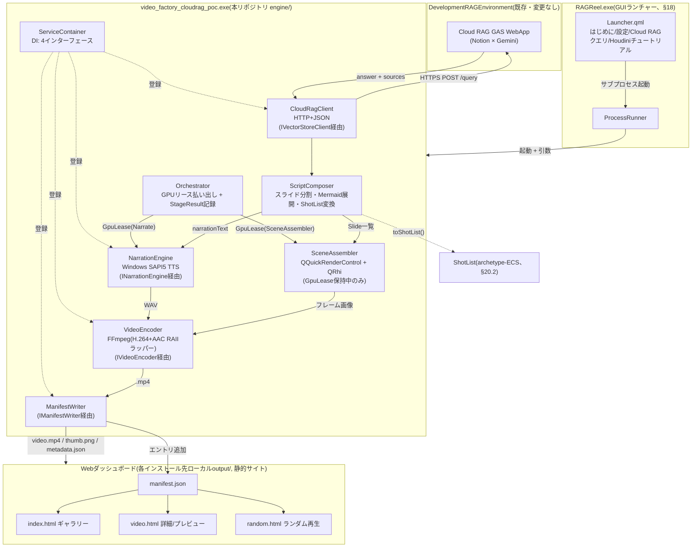
```mermaid
flowchart TB
    subgraph rag["DevelopmentRAGEnvironment(既存・変更なし)"]
        GAS["Cloud RAG GAS WebApp<br/>(Notion × Gemini)"]
    end

    subgraph launcher["RAGReel.exe(GUIランチャー、§18)"]
        UI["Launcher.qml<br/>はじめに/設定/Cloud RAGクエリ/Houdiniチュートリアル"]
        PR["ProcessRunner"]
    end

    subgraph engine["video_factory_cloudrag_poc.exe(本リポジトリ engine/)"]
        ORCH["Orchestrator<br/>GPUリース払い出し + StageResult記録"]
        SVC["ServiceContainer<br/>DI: 4インターフェース"]
        CRC["CloudRagClient<br/>HTTP+JSON<br/>(IVectorStoreClient経由)"]
        NE["NarrationEngine<br/>Windows SAPI5 TTS<br/>(INarrationEngine経由)"]
        SC["ScriptComposer<br/>スライド分割・Mermaid展開・ShotList変換"]
        SA["SceneAssembler<br/>QQuickRenderControl + QRhi<br/>(GpuLease保持中のみ)"]
        VE["VideoEncoder<br/>FFmpeg(H.264+AAC RAIIラッパー)<br/>(IVideoEncoder経由)"]
        MW["ManifestWriter<br/>(IManifestWriter経由)"]
    end

    subgraph web["Webダッシュボード(各インストール先ローカルoutput/, 静的サイト)"]
        GALLERY["index.html ギャラリー"]
        DETAIL["video.html 詳細/プレビュー"]
        RANDOM["random.html ランダム再生"]
        MANIFEST["manifest.json"]
    end

    UI -- "サブプロセス起動" --> PR
    PR -- "起動 + 引数" --> engine
    SVC -.->|"登録"| CRC
    SVC -.->|"登録"| NE
    SVC -.->|"登録"| VE
    SVC -.->|"登録"| MW
    ORCH -- "GpuLease(Narrate)" --> NE
    ORCH -- "GpuLease(SceneAssembler)" --> SA
    CRC -- "HTTPS POST /query" --> GAS
    GAS -- "answer + sources" --> CRC
    CRC --> SC
    SC -- "narrationText" --> NE
    NE -- "WAV" --> VE
    SC -- "Slide一覧" --> SA
    SC -.->|"toShotList()"| SHOTS["ShotList(archetype-ECS、§20.2)"]
    SA -- "フレーム画像" --> VE
    VE -- ".mp4" --> MW
    MW -- "video.mp4 / thumb.png / metadata.json" --> web
    MW -- "エントリ追加" --> MANIFEST
    MANIFEST --> GALLERY
    MANIFEST --> DETAIL
    MANIFEST --> RANDOM
```

**重要な設計判断(設計書§2から継続):** Faissのような専用ベクトルDBをC++側に埋め込まず、既存のCloud RAG HTTPブリッジ(GAS WebApp)をそのまま叩く。C++側はHTTPクライアントに徹する。

**設計書との既知の乖離(§20.0で詳述):** `VectorStoreClient`は設計書が想定する`rag_local_bridge.py:8766`ではなくCloud RAG GAS WebApp向け。Webダッシュボードの公開先は共有`web/public/`ではなく、インストール先ごとのローカル`output/`(「RAGReel配布」方針)。

---

## 3. 実装状況(フェーズ進捗)

| Phase | 内容 | 状態 |
|---|---|---|
| 0 | 設計文書 + リポジトリスケルトン + `.gitignore` | ✅完了 |
| 1 | 静的QMLシーン → FFmpeg muxのヘッドレスレンダリングPoC(`video_factory_poc.exe`) | ✅完了 |
| 2 | Cloud RAG HTTPクライアント + 実際の回答から動画生成(`video_factory_cloudrag_poc.exe`) | ✅完了 |
| 2.5 | 音声ナレーション(SAPI TTS)・尺の自動調整・スライド形式・Mermaid図解・図/コードの音声解説・Webダッシュボード自動公開・ランダム再生 | ✅完了 |
| 2.6 | 分割画面チャプター形式(KISARAGIスタイル)への映像レイアウト刷新、スライドごとの個別Mermaid図解生成(`enrichSlidesForDisplay`)、実データ運用で発覚した品質バグ2件の修正(要点重複・図解への出典番号混入) | ✅完了(本ドキュメントの主対象) |
| 3 | `ResourceBudgetManager`のVRAM排他制御(`GpuLease`) | ✅実装済み(2026-08-14、§20.1)。llama.cppによるローカルナレーション整形自体は引き続き未着手 |
| 4 | web-production-skillによるダッシュボードの本格デザイン | 部分実装(簡易デザインのみ) |
| 5 | 生成動画のRAGへの書き戻し(自己改善ループ) | 未着手 |
| 6 | Houdini実画面レンダリングとの連携(`DevelopmentRAGEnvironment`のHoudiniチュートリアル生成から本システムを呼び出し) | LearningQt側は実装・検証済み / Houdini側は別セッションにより2026-08-08に実機検証・修正済み(§19参照) |
| 7 | RAGReel.exe(非エンジニア向けGUIランチャー) | ✅実装済み(§18) |
| 8 | アーキテクチャ・リファクタリング(`Orchestrator`/`ScriptComposer`/`SceneAssembler`/`ServiceContainer`抽出、CI新設) | ✅実装済み(2026-08-14、`IMPROVEMENT_PLAN.md`Phase 1〜5、§20) |

---

## 4. Qt/C++エンジン: コンポーネント詳細

### 4.1 実行ファイル

| 実行ファイル | 役割 |
|---|---|
| `video_factory_poc.exe` | Phase 1のPoC。固定QMLシーン(`TutorialScene.qml`)を描画してmp4化するだけ。RAG連携なし |
| `video_factory_cloudrag_poc.exe` | 本プロジェクトの本体。Cloud RAG連携・TTS・スライド分割・Mermaid図解・Webダッシュボード自動公開まで含む |

### 4.2 モジュール一覧

| モジュール | ファイル | 役割 |
|---|---|---|
| CloudRagClient | `engine/src/ragclient/cloud_rag_client.{h,cpp}` | GAS WebAppへのHTTP POSTクライアント(`QNetworkAccessManager`+`QEventLoop`による同期化) |
| NarrationEngine | `engine/src/narration/narration_engine.{h,cpp}` | Windows SAPI5によるテキスト音声合成(WAV出力) |
| VideoEncoder | `engine/src/encode/video_encoder.{h,cpp}` | libavcodec/libavformat/libswresampleのRAIIラッパー。映像(H.264)+音声(AAC)のmux |
| ManifestWriter | `engine/src/manifest/manifest_writer.{h,cpp}` | 生成物をWebダッシュボードへコピー・`manifest.json`更新 |
| main_cloudrag.cpp | `engine/src/main_cloudrag.cpp` | オーケストレーター。スライド分割・Mermaid処理・レンダリングループを統括 |
| CloudRagScene.qml | `engine/qml/CloudRagScene.qml` | データ駆動の分割画面(左情報パネル+右ビジュアルパネル+フッタータイムライン)シーン。詳細は§7 |

### 4.3 CloudRagClient

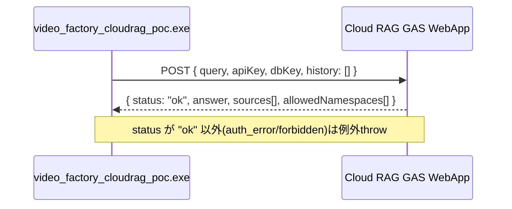
```mermaid
sequenceDiagram
    participant App as video_factory_cloudrag_poc.exe
    participant GAS as Cloud RAG GAS WebApp

    App->>GAS: POST { query, apiKey, dbKey, history: [] }
    GAS-->>App: { status: "ok", answer, sources[], allowedNamespaces[] }
    Note over App,GAS: status が "ok" 以外(auth_error/forbidden)は例外throw
```

- 認証情報(`CLOUD_RAG_URL` / `CLOUD_RAG_API_KEY`)は**環境変数のみ**で受け渡し、リポジトリ・設定ファイルには一切保存しない(Unity/Houdiniクライアントと同じ方針)
- `dbKey`一覧: `all`(全DB横断) / `tool_docs` / `game_info` / `research` / `team_notes` / `afuri` / `braintq` / `fourteen` / `houdini21`

### 4.4 NarrationEngine

- Windows SAPI5(`ISpVoice`/`ISpStream`)を直接COM呼び出し(ATL/`sphelper.h`は未使用 — ATLがインストールされていない環境のため、素の`sapi.h`のみで実装)
- 44.1kHz・モノラル・16bit PCM WAVを出力
- `ISpObjectTokenCategory::EnumTokens(L"language=411", ...)` で日本語(ja-JP, LCID 0x411)ボイスを優先選択、無ければシステムデフォルトにフォールバック
- 生成されたWAVのファイルサイズから実際の音声長を逆算し、動画の尺を決定する材料にする

### 4.5 VideoEncoder(音声対応拡張)

RAII方針(設計書§4)を維持しつつ、Phase 2.5で音声トラックに対応:

| リソース | ラッパー型 |
|---|---|
| `AVFormatContext` | `AVFormatContextPtr`(カスタムデリータ`unique_ptr`) |
| `AVCodecContext`(映像/音声 各1つ) | `AVCodecContextPtr` |
| `AVFrame` | `AVFramePtr` |
| `AVPacket` | `AVPacketPtr` |
| `SwsContext`(映像スケーリング) | `SwsContextPtr` |
| `SwrContext`(音声リサンプリング) | `SwrContextPtr` |

音声パイプライン: WAVファイルをチャンク読み取り(独自の軽量RIFFパーサ) → `swr_alloc_set_opts2`でS16→AACエンコーダのsample_fmtへ変換 → ネイティブAACエンコーダでエンコード → `av_interleaved_write_frame`で映像と自動的にインターリーブ(呼び出し順序に依存せず、muxerがdtsベースで整列)。

---

## 5. 動画生成パイプライン

### 5.1 全体フロー


```mermaid
flowchart LR
    A["Cloud RAGへ質問<br/>(query)"] --> B["回答取得<br/>(answer + sources)"]
    B --> C["図解/コード説明<br/>follow-upクエリ"]
    C --> D["ナレーション文生成<br/>(Markdown→プレーンテキスト)"]
    D --> E["SAPI TTS合成<br/>(WAV + 実測長)"]
    E --> F["尺を決定<br/>(音声長+余韻)"]
    F --> G["スライド分割<br/>splitIntoSlides→expandDiagramSlides→splitLongTextSlides"]
    G --> G2["表示情報の付加<br/>enrichSlidesForDisplay<br/>(要点2つ抽出/コード検出/スライド単位の図解follow-up)"]
    G2 --> H["フレームごとにQML<br/>プロパティ設定→レンダリング"]
    H --> I["FFmpegへpush<br/>(映像+音声mux)"]
    I --> J["ManifestWriter<br/>Webダッシュボードへ公開"]
```

### 5.2 スライド分割ロジック(3段階)

「回答は`##`見出しがあるとは限らない」「1セクションが長すぎるとスクロールに頼りきりになる」という2つの実問題に対応するため、3段階のパイプラインになっている。

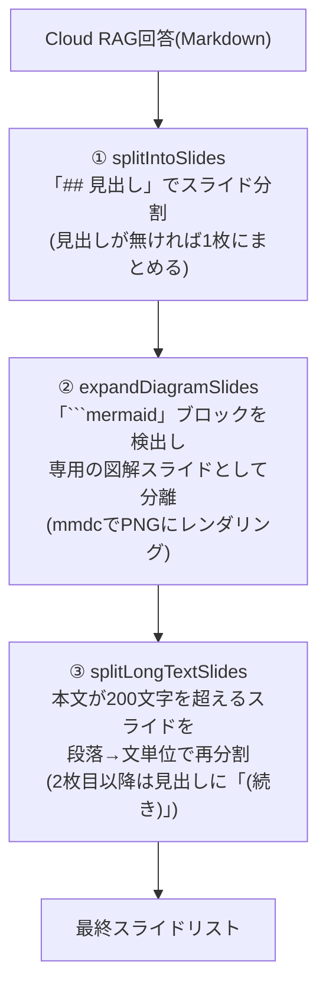
```mermaid
flowchart TD
    Start["Cloud RAG回答(Markdown)"] --> Split1["① splitIntoSlides<br/>「## 見出し」でスライド分割<br/>(見出しが無ければ1枚にまとめる)"]
    Split1 --> Split2["② expandDiagramSlides<br/>「```mermaid」ブロックを検出し<br/>専用の図解スライドとして分離<br/>(mmdcでPNGにレンダリング)"]
    Split2 --> Split3["③ splitLongTextSlides<br/>本文が200文字を超えるスライドを<br/>段落→文単位で再分割<br/>(2枚目以降は見出しに「(続き)」)"]
    Split3 --> Final["最終スライドリスト"]
```

この3段構成により、**見出しの有無にかかわらず必ずダイジェスト(スライド)形式になる**ことを保証している(以前は見出しが無い回答が1枚の全スクロール動画になってしまうバグがあったため、③を追加して修正した)。

### 5.3 スライドの時間配分

各スライドの表示時間は本文の文字数に比例配分(最低文字数フロアあり)。`computeSlideStartFrames()`が文字数の重み付けからフレーム境界のルックアップテーブルを構築し、レンダリングループが現在のフレームがどのスライドに属するかを判定してQMLへプロパティ(`slideHeading`/`slideBullet1`/`slideBullet2`/`slideProgress`等)を渡す。

### 5.4 enrichSlidesForDisplay(表示情報の付加)

Phase 2.6の分割画面レイアウト(§7)では、スライド本文をそのまま画面に流し込まない(ナレーションでのみ読み上げる)。代わりに各スライドについて、画面表示用の情報を1枚ずつ組み立てる:

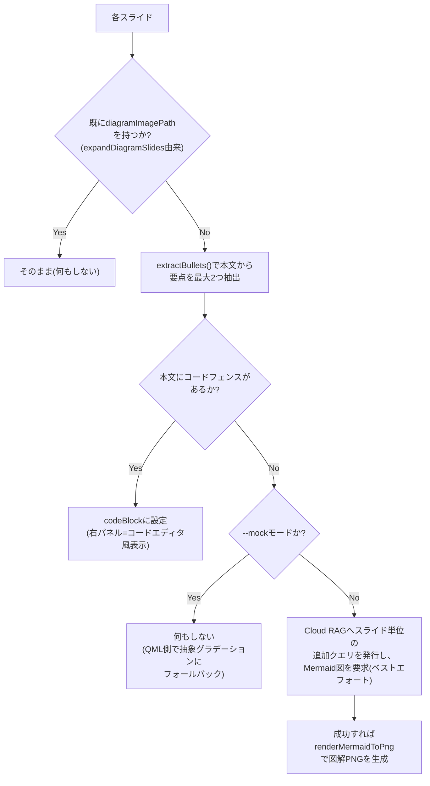
```mermaid
flowchart TD
    S["各スライド"] --> Q1{"既にdiagramImagePath<br/>を持つか?<br/>(expandDiagramSlides由来)"}
    Q1 -- Yes --> Skip["そのまま(何もしない)"]
    Q1 -- No --> B["extractBullets()で本文から<br/>要点を最大2つ抽出"]
    B --> Q2{"本文にコードフェンスが<br/>あるか?"}
    Q2 -- Yes --> Code["codeBlockに設定<br/>(右パネル=コードエディタ風表示)"]
    Q2 -- No --> Q3{"--mockモードか?"}
    Q3 -- Yes --> Fallback["何もしない<br/>(QML側で抽象グラデーションに<br/>フォールバック)"]
    Q3 -- No --> Ask["Cloud RAGへスライド単位の<br/>追加クエリを発行し、<br/>Mermaid図を要求(ベストエフォート)"]
    Ask --> Render["成功すればrenderMermaidToPng<br/>で図解PNGを生成"]
```

このスライド単位クエリはベストエフォートで、失敗しても例外を握りつぶしてそのスライドをスキップするだけ(1スライドの図解生成失敗が動画全体を止めない)。

---

## 6. Cloud RAG連携

### 6.1 図解生成の仕組み

実際のCloud RAG回答(Gemini生成)には`\`\`\`mermaid`ブロックがほぼ含まれない(GAS側のプロンプトが図解生成を指示していないため)。これに対応するため、LearningQt側だけで完結する追加クエリ機構を実装した。

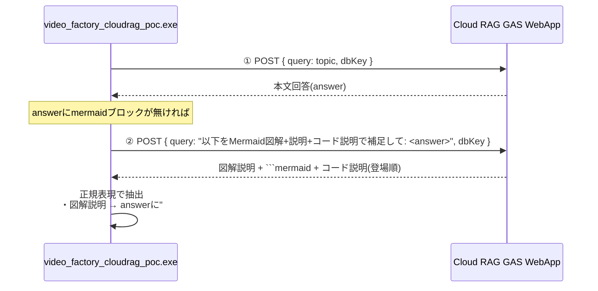
```mermaid
sequenceDiagram
    participant App as video_factory_cloudrag_poc.exe
    participant GAS as Cloud RAG GAS WebApp

    App->>GAS: ① POST { query: topic, dbKey }
    GAS-->>App: 本文回答(answer)

    Note over App: answerにmermaidブロックが無ければ

    App->>GAS: ② POST { query: "以下をMermaid図解+説明+コード説明で補足して: <answer>", dbKey }
    GAS-->>App: 図解説明 + ```mermaid + コード説明(登場順)

    App->>App: 正規表現で抽出<br/>・図解説明 → answerに"## 図解"セクションとして合成<br/>・コード説明[] → ナレーション生成時に順番通り差し込み
```

この機構により、DevelopmentRAGEnvironment側(GASプロンプト)には一切変更を加えずに図解機能を実現している。

### 6.2 図解・コードの音声説明

以前は図解・コードブロックに差し掛かると、ナレーションが「(図解は画面をご覧ください。)」「(コード例は画面をご覧ください。)」という汎用フレーズになり説明が無いに等しかった。上記の追加クエリで取得した実際の説明文を使うよう修正:

- **図解の説明**: `## 図解`セクションの本文(見出しの下・図の直前)としてMarkdownに合成 → 既存のスライド分割ロジックが自動的に「説明文スライド→図解スライド」の2枚に分け、説明文は通常のプレーンテキストとして自然にナレーションされる
- **コードの説明**: `stripMarkdownForNarration()`が本文中の各コードフェンスを検出順に走査し、対応する説明文(follow-upクエリで取得した配列を順番に消費)に置き換える。取得できなかった分は汎用フレーズにフォールバック

---

## 7. 映像レイアウト: 分割画面チャプター形式(KISARAGIスタイル)

Phase 2.6でユーザーが提示したプロ品質の製品紹介動画(左:情報パネル、右:大きなビジュアル、下部:チャプタータイムライン)を参考に、`CloudRagScene.qml`を全面刷新した。以前の「1枚のカードに全文スクロール」形式から、チャプターごとに画面が切り替わる分割画面レイアウトへ移行している。

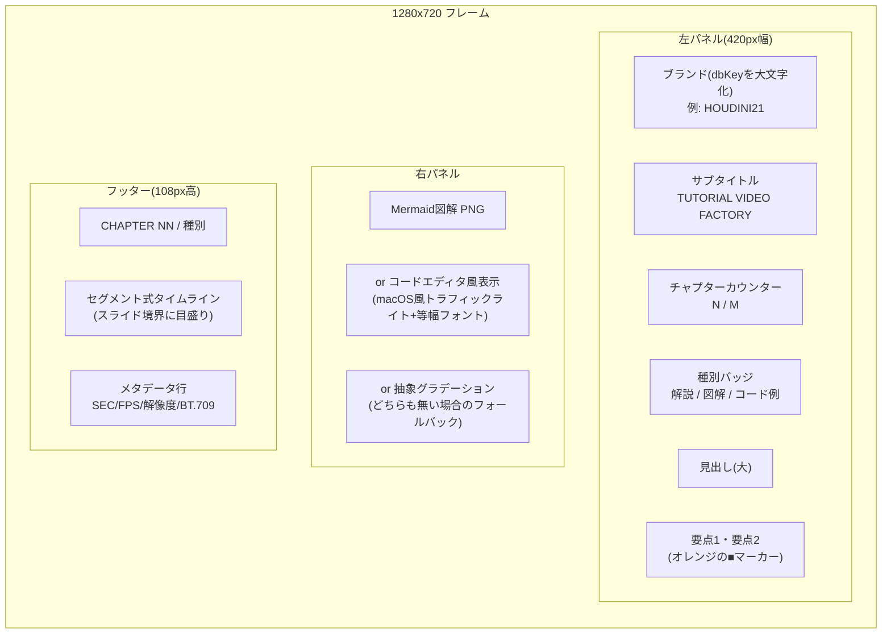
```mermaid
flowchart LR
    subgraph frame["1280x720 フレーム"]
        subgraph left["左パネル(420px幅)"]
            L1["ブランド(dbKeyを大文字化)<br/>例: HOUDINI21"]
            L2["サブタイトル<br/>TUTORIAL VIDEO FACTORY"]
            L3["チャプターカウンター<br/>N / M"]
            L4["種別バッジ<br/>解説 / 図解 / コード例"]
            L5["見出し(大)"]
            L6["要点1・要点2<br/>(オレンジの■マーカー)"]
        end
        subgraph right["右パネル"]
            R1["Mermaid図解 PNG"]
            R2["or コードエディタ風表示<br/>(macOS風トラフィックライト+等幅フォント)"]
            R3["or 抽象グラデーション<br/>(どちらも無い場合のフォールバック)"]
        end
        subgraph footer["フッター(108px高)"]
            F1["CHAPTER NN / 種別"]
            F2["セグメント式タイムライン<br/>(スライド境界に目盛り)"]
            F3["メタデータ行<br/>SEC/FPS/解像度/BT.709"]
        end
    end
```

**設計判断(ユーザーとの確認済み事項):**

| 論点 | 決定 | 理由 |
|---|---|---|
| ブランドラベル | `dbKey`を大文字化してそのまま表示(例: `houdini21`→`HOUDINI21`) | 固定の製品ブランド名の代わりに、参照元DBを可視化する意味も兼ねる |
| キャプション言語 | 日本語のみ、英語併記なし | シンプルさを優先。対象動画は日本語ナレーションが前提のため |
| 右パネルのビジュアル | ハイブリッド方式: コードスライドはコードエディタ風モックアップ、平文スライドはスライド単位のMermaid図解、どちらも無ければ抽象グラデーション | 「実際の画面」に近い情報密度を、実装コストを抑えつつ実現(Houdini実画面キャプチャは§15の次フェーズ課題) |

本文テキストはもはや画面に直接表示しない(ナレーションでのみ読み上げる)。画面には要点2つ(`extractBullets()`が抽出)だけを表示し、「一目で分かる」情報量に絞っている。スライド境界での遷移は`slideProgress`に基づくフェードイン/アウト(最初/最後の12%区間)で、チャプター切り替えが唐突にならないようにしている。

---

## 8. ナレーション・図解の品質改善

| 改善項目 | Before | After |
|---|---|---|
| フォーマット | 1枚のカードに全文を流し込みスクロール | 見出し単位のスライド + フェード遷移 + スライドカウンター表示 |
| 尺 | 固定6秒 | 実際のTTS音声長に応じて自動調整(最低4秒+余韻1.5秒) |
| フォント/配色 | 簡易的な単色 | Yu Gothic UI・上部プログレスバー・カードパネル・グラデーション背景 |
| 図解 | ほぼ発生しない(モックのみ) | follow-upクエリで実質確実に生成 |
| 図解/コードの説明 | 「画面をご覧ください」の一言 | 実際の内容説明(follow-upクエリで取得) |
| 出力ファイル名 | 固定名(再実行で上書き・混同) | 実行ごとにタイムスタンプ付きでユニーク化 |

---

## 9. 実データ運用で発覚した品質バグと修正

Phase 2.6のレイアウト刷新後、`--mock`ではなく実際のCloud RAG認証情報・実データ(トピック「花火のパーティクルの作り方について教えてください」、`dbKey=houdini21`)で生成した動画をユーザーが確認したところ、`--mock`のテスト内容だけでは表面化しなかった2件の品質バグが見つかった。

### 9.1 要点の重複

**症状:** 左パネルの要点1・要点2に、同一内容がほぼそのまま2回表示される。しかも2回目には先頭に`- `という生のMarkdownリストマーカーが残っていた。

**原因:** `extractBullets()`は「①`-`/`*`始まりの行を正規表現で拾う」→「①で2件集まらなければ、本文全体を文単位に分割してフォールバック補完する」という2段階構成だった。本文にリスト項目が1件しか無い場合、①で1件確保した後、②のフォールバックが**同じ本文全体を再スキャン**するため、①で既に拾った文がそのまま「新しい文」として再度ヒットしていた。さらに②のフォールバック側は先頭の`- `/`* `マーカーを除去する処理が無かったため、リストマーカー付きのまま重複表示されていた。

**修正:** `engine/src/main_cloudrag.cpp`の`extractBullets()`に、正規化した内容(先頭マーカー除去+空白除去)をキーにした重複排除ステップを追加。①・②どちらの経路で拾った候補も、既に採用済みの内容と正規化後に一致すればスキップする。あわせて②のフォールバック側にも`^[-*]\s+`除去を追加し、そもそもマーカー付きで拾わないようにした。

### 9.2 図解への出典番号混入

**症状:** Mermaid図解に、本来の内容とは無関係な孤立した`1`だけのノードなどが混入する。

**原因:** Cloud RAGの回答本文には`[1]`や`[4]`のような出典番号が付与される。この本文をそのままMermaid図解生成プロンプトに埋め込んでいたため、生成された図解のノードラベルに出典番号が紛れ込むケースがあった。さらに厄介なことに、Mermaid記法そのものが`[...]`を四角形ノードの構文として解釈するため、番号だけが単独ノードとして誤描画される事故が起きていた。

**修正:** 出典番号除去用の共通ヘルパー`stripCitationMarkers()`(正規表現`\[\d+\]`)を新設し、以下の3箇所で図解生成プロンプトに渡す直前に適用するよう修正:

1. `enrichSlidesForDisplay()`のスライド単位図解クエリ(見出し・本文の両方)
2. メインの図解+コード説明follow-upクエリの入力(`response.answer`全体)
3. follow-upクエリの返答から抽出した図解キャプション・Mermaidブロック自体(モデルが出典番号を復唱してくる場合への保険)

ナレーション用の`stripMarkdownForNarration()`も同じヘルパーを使うよう統一し、実装の重複を解消した。

### 9.3 検証方法(1回目)

`--mock`フィクスチャ(`mockResponse()`)は元々出典番号`[1][2]`を含む文面を持つため、この2件のバグを再現できる。修正後にビルドし直し、`--mock`で動画を再生成、`ffmpeg`でフレームを間引き抽出して目視確認: 要点の重複・生のリストマーカー残存・図解への孤立ノード混入のいずれも解消されていることを確認済み。

### 9.4 実データ第2ラウンド: 残っていた3件

上記9.1/9.2の修正後、ユーザーが実際に`"花火のパーティクルの作り方について教えてください" houdini21`で再実行したところ、`--mock`のテストパターンでは想定していなかった3件がさらに見つかった。

**① 要点の「先頭だけ重複」(9.1の修正で防げなかった別パターン)**

- **症状:** 1つの箇条書き行が「文A。-  文B。」のように複数の文を含む場合、要点1にはその行全体(文A+文B)が表示され、要点2には**文Aの先頭部分だけを切り詰めたもの**が再度表示された。
- **原因:** 9.1の重複排除は「正規化後に完全一致する候補」だけをスキップする実装だった。しかしこのケースでは、フォールバックの文分割候補(文Aのみ)は、既に採用済みの要点1(文A+文B)の**部分文字列**に過ぎず、完全一致しないため重複排除をすり抜けていた。さらに根本的には、「①のリスト行走査で1件でも見つかった時点で、②のフォールバック文分割に頼るべきではない」という設計判断が抜けていた。
- **修正:** フォールバック文分割の発動条件を`bullets.size() < 2`(2件集まるまで実行)から`bullets.isEmpty()`(1件も見つからなかった時だけ実行)に変更。本文が持つ本来のリスト構造を尊重し、リスト項目が1件しか無いスライドは要点も1件だけ(空白の方がまし)とした。

**② 出典表記が数値形式`[1]`限定でしか除去できていなかった**

- **症状:** 実際のhoudini21回答は`[参考: 過去Q&A]`のような説明的な出典表記を使っており、要点・ナレーションにそのまま残っていた。
- **原因:** `stripCitationMarkers()`の正規表現が`\[\d+\]`(数字のみ)に限定されていた。DB・回答によって出典表記のフォーマットが異なることを想定できていなかった。
- **修正:** 正規表現を`\[[^\[\]]{1,60}\]`(角括弧で囲まれた任意の短いテキスト)に一般化。コードフェンス内の`array[0]`のような構文を壊さないよう、コードを含まないプローズ(要点・ナレーション・図解プロンプト)にのみ適用される箇所であることを確認済み。

**③ コンソール出力の文字化え**

- **症状:** 実行時にログの`Querying Cloud RAG: topic=...`等のログ行が文字化けして表示される(例: `topic=闃ｱ轣ｫ縺ｮ...`)。
- **原因:** コマンドライン引数自体は`QString::fromLocal8Bit()`で正しくデコードされており、Cloud RAGへの実際のクエリや動画の生成内容には影響が無い。問題は`logLine()`が書き出すUTF-8バイト列を、Windowsコンソールの出力コードページ(既定では非UTF-8)がそのまま誤って解釈していたこと(表示のみの問題)。
- **修正:** `main()`冒頭で`SetConsoleOutputCP(CP_UTF8)`(Win32 API、`<windows.h>`)を呼び出すよう追加。あわせて、`windows.h`が定義する`max`/`min`マクロが既存の`std::max`呼び出しと衝突してビルドエラーになったため、`#define NOMINMAX`をインクロード前に追加した。

### 9.5 検証方法(2回目)

`mockResponse()`フィクスチャに、①②の症状を再現する専用セクション(「## 応用: パーティクルの寿命制御」、1つのリスト行に2文+説明的出典表記`[参考: 過去Q&A]`を含む)を回帰テストとして追加。修正後にビルドし直し、`--mock`で動画を再生成、`ffmpeg`でフレーム抽出して目視確認: 要点は1件のみ(重複無し)・出典表記は完全に除去されていることを確認済み。③はこのセッションにCloud RAG認証情報が無く実クエリを再現できなかったため、修正は適用済みだがユーザー自身による実データでの再確認が必要。

---

## 10. Webダッシュボード

### 10.1 ページ構成

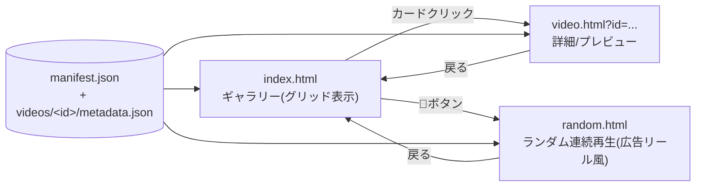
```mermaid
flowchart LR
    IDX["index.html<br/>ギャラリー(グリッド表示)"] -->|カードクリック| DET["video.html?id=...<br/>詳細/プレビュー"]
    IDX -->|🔀ボタン| RND["random.html<br/>ランダム連続再生(広告リール風)"]
    DET -->|戻る| IDX
    RND -->|戻る| IDX

    MANIFEST[("manifest.json<br/>+ videos/&lt;id&gt;/metadata.json")] --> IDX
    MANIFEST --> DET
    MANIFEST --> RND
```

- **静的サイトのみ、バックエンド無し**(設計書§5の方針を継続)。`fetch()`でJSONを読み込むだけなので、ローカルHTTPサーバー(`python -m http.server`等)での配信が必要(`file://`直接オープンはCORSで失敗する)
- **video.html**: 埋め込み動画プレイヤー、RAG出典一覧、「生成プロセス」の振り返り表示(実測タイミング付きパイプラインカード)、再生成コマンドのコピーボタン(v1では実行トリガーにはしない)
- **random.html**: シャッフル+自動連続再生。ミュート状態でオートプレイ開始(ブラウザの自動再生制限対策)、視聴終了で自動的に次の動画へ、全部見終わったら再シャッフルして無限ループ

### 10.2 manifest.jsonスキーマ

```jsonc
// manifest.json — 集約インデックス(新しい順)
[
  {
    "id": "cloudrag_20260714_192246",
    "slug": "cloudrag_20260714_192246",
    "title": "string",
    "created_at": "ISO8601",
    "duration_sec": 84.4,
    "video_path": "videos/<id>/video.mp4",
    "thumbnail_path": "videos/<id>/thumb.png",
    "tags": ["<dbKey>", "cloud-rag"],
    "status": "done",
    "source_tutorial": "cloud-rag:<dbKey>",
    "estimated_tokens": 522
  }
]
```

`estimated_tokens`は§16で解説する推定トークン消費量(文字数ベースの概算、実測値ではない)。

```jsonc
// videos/<id>/metadata.json
{
  "narration_summary": "string",
  "rag_sources": [{ "file": "string", "namespace": "string", "similarity": 0.0, "excerpt": "" }],
  "pipeline": [
    { "stage": "ingest", "label": "取り込み", "status": "done", "duration_sec": 0.0 },
    { "stage": "compose", "label": "構成 (スライド分割)", "status": "done", "duration_sec": 0.0 },
    { "stage": "narrate", "label": "ナレーション (SAPI TTS)", "status": "done", "duration_sec": 0.0 },
    { "stage": "render", "label": "レンダリング+エンコード", "status": "done", "duration_sec": 0.0 },
    { "stage": "publish", "label": "公開", "status": "done", "duration_sec": 0.0 }
  ],
  "estimated_tokens": 522
}
```

`pipeline`の各`duration_sec`は`QElapsedTimer`による**実測値**(設計時のプレースホルダーではない)。

### 10.3 ManifestWriter の自動公開フロー

動画生成が成功すると、`ManifestWriter::publish()`が以下を自動実行する(手動コピー不要):

1. `web/public/videos/<id>/`ディレクトリを作成
2. 生成したmp4をコピー
3. レンダリング中(全体の40%地点)のフレームをサムネイルとしてPNG保存(JPEGは追加プラグイン配置が必要なため回避)
4. `metadata.json`を書き出し
5. `manifest.json`を読み込み、**既存エントリを保持したまま**新エントリを先頭に追加して書き戻し

---

## 11. ビルド・実行手順

### 11.1 トールチェーン

- CMake + Ninja + MSVC(Visual Studio 2022。開発機ではセッション途中にVisual Studioが自動更新され`Visual Studio\18\Community`へパスが変わったことがあるため、`vcvars64.bat`のパスがずれた場合はインストール先を再確認すること)
- vcpkg(manifestモード、`vcpkg.json`)経由でQt6(qtbase/qtdeclarative)・FFmpeg(x264/AAC込み)・GTest(2026-08-14追加、§20.5)を取得
- `mermaid-cli`(npmグローバルパッケージ `@mermaid-js/mermaid-cli`)を図解レンダリングに使用

```powershell
cmake --preset default
cmake --build --preset default
```

CIランナー(`VCPKG_ROOT`環境変数からvcpkgを解決)では代わりに`ci`プリセットを使う。ローカル開発機用の`default`(`C:/vcpkg`固定)には影響しない(§20.5):

```powershell
cmake --preset ci
cmake --build --preset ci
```

### 11.2 実行ファイル一覧

| 実行ファイル | 役割 | 対象ユーザー |
|---|---|---|
| `build/engine/video_factory_cloudrag_poc.exe` | 動画生成エンジン本体(CLI) | 開発者・自動化スクリプトからの呼び出し |
| `build/engine/RAGReel.exe` | 上記のGUIランチャー(§18) | 非エンジニアのチームメンバー |
| `build/engine/resource_budget_manager_test.exe` | Phase 1のGPUリース排他制御テスト | CI/開発者 |
| `build/engine/script_composer_tests.exe` | Phase 2のScriptComposer単体テスト(GTest) | CI/開発者 |

### 11.3 動画生成エンジンの実行(CLI)

```powershell
$env:CLOUD_RAG_URL = "https://script.google.com/macros/s/XXXX/exec"
$env:CLOUD_RAG_API_KEY = "..."

cd build\engine
.\video_factory_cloudrag_poc.exe "<質問文>" "<dbKey>"
```

- `--mock` / `--mock-plain`フラグでAPIキー無しにサンプルデータで動作確認可能(開発用。環境変数も不要)
- `--houdini-md <path.md>` [`--houdini-json <path.json>`] [`--houdini-screenshots <path_screenshots.json>`]でHoudiniチュートリアル取り込みモード(§15/§19)。`--mock`と併用すると図解follow-upクエリもスキップされ、完全にオフラインで動作確認できる
- 実行後、実行ファイルと同じディレクトリの`output/`配下に自動公開される(§18で述べる「RAGReel配布」方針により、以前の共有`web/public/`ではなくインストール先ローカル)。`cd build\engine; python -m http.server`等で`output/`を配信して確認する

### 11.4 RAGReel(GUIランチャー)の実行

```powershell
cd build\engine
.\RAGReel.exe
```

詳細な操作手順は§18およびこのセッションの回答本文(「動作手順」)を参照。

### 11.5 テストの実行

```powershell
cd build
ctest --output-on-failure
```

`resource_budget_manager_test`(GPUリース排他制御、フレームワーク不使用)と`script_composer_tests`(GTest、9ケース)の2スイートが登録済み(§20.1/§20.5)。どちらもQt6::Quick/GPU/表示デバイス不使用で、ヘッドレスCI環境でも実行できる。

---

## 12. 実装中に判明した技術的な落とし穴

開発中に踏んだ問題とその対処をまとめる(同じ問題を再度踏まないためのメモ)。

| 問題 | 原因 | 対処 |
|---|---|---|
| `QQuickRenderControl::initialize()`が失敗する | `QT_QPA_PLATFORM=offscreen`はD3D11コンテキストを作れない | デフォルトの`windows`プラットフォームのまま使う(ウィンドウは表示されない) |
| 実行時に何も表示されず即終了 | Qtの`platforms/`プラグインフォルダが実行ファイルと同じ場所に無い | CMakeのPOST_BUILDでプラグインディレクトリを自動コピー |
| `qt.network.ssl: No functional TLS backend was found` | `tls/`プラグイン(qopensslbackend.dll)と`libssl-3-x64.dll`が未配置 | 同上の仕組みで`tls/`もコピー、libsslも明示的にコピー |
| サムネイル保存が失敗する | JPEGはQtの実行時プラグイン(`imageformats/qjpeg.dll`)が必要で未配置 | PNG形式に変更(QtGuiに標準搭載、プラグイン不要) |
| `qDebug()`/`qCritical()`の出力が全く見えない | このコンソールサブシステムexeをリダイレクト付きで起動すると、Qtの既定メッセージハンドラがstderrに届かないことがある | `std::fprintf(stderr, ...)`を直接使う |
| トピックを変えて再実行しても古い動画に見える | 出力ファイル名が固定(`phase2_cloudrag_poc.mp4`)で毎回上書きされていた | 実行時刻ベースの`runId`を全生成物のファイル名に付与 |
| 見出しの無い回答が全スクロール動画になる | `splitIntoSlides`は見出しが無いと1枚の巨大スライドにフォールバックしていた | `splitLongTextSlides`で段落/文単位の強制再分割を追加 |
| `splitLongTextSlides`がコードフェンスを分断する | 段落/文単位の再分割ロジックが```コードフェンスの構文を認識せず、フェンスの途中でスライド境界を作ってしまうことがあった | コードフェンスを含むスライドは長さ判定の対象から除外(分割しない)ように修正 |
| `--mock`のスライド5枚目に空行入りの要点・生のバッククォートが表示される | `extractBullets()`のフォールバック文分割がコードフェンス除去後の空行や`` ` ``をそのまま残していた | 空白の連続を1つのスペースに畳み込み、バッククォート/太字マーカーを除去する処理を追加 |
| 要点が2回表示される・図解に出典番号ノードが混入する | §9参照(要点重複・出典番号混入バグ) | §9.1/§9.2の修正を参照 |
| Visual Studioがセッション中に自動的に「2022」→バージョン「18」へ更新され、ビルドスクリプトの`vcvars64.bat`固定パスが無効になった | Windows/VS Installerの自動更新 | `vswhere.exe`で実際のインストール先を確認し、スクリプトのパスを更新。CMakeCache/CMakeFilesを削除して再configure(`vcpkg_installed/`は再ビルド回避のため保持) |
| 要点が「先頭だけ切り詰められて」再度表示される・実データの出典表記(`[参考: ...]`等)が残る・コンソールログが文字化けする | §9.4参照(要点の部分重複・出典表記の一般化不足・コンソールコードページ) | §9.4の修正を参照 |
| `SetConsoleOutputCP`追加時に`std::max(...)`が`error C2589: '(' : ... トークンは使えません`でビルド失敗 | `<windows.h>`の`max`/`min`マクロが`std::max`/`std::min`呼び出しと衝突 | `<windows.h>`をインクルードする前に`#define NOMINMAX`を追加 |

---

## 13. ファイル構成

**2026-08-14更新:** `IMPROVEMENT_PLAN.md`のPhase 1〜5により`engine/src/`が大幅に整理された。以前は`main_cloudrag.cpp`1ファイル(匿名名前空間内に約1000行)に collapsed していたスライド分割・レンダリング・DIロジックが、それぞれ独立したディレクトリに切り出されている。

```
LearningQt/
├── docs/
│   ├── architecture/video-factory-design.md   # 初期設計書(Phase 0) + §17実装乖離の追補(2026-08-14)
│   └── technical-reference.md                  # 本ドキュメント
├── IMPROVEMENT_PLAN.md                          # アーキテクチャ・リファクタリング計画+実施結果(2026-08-14)
├── lecture/
│   └── video-factory-lecture.html               # 講義資料(HTML)
├── .github/workflows/
│   ├── build.yml                                # CMake configure+build+ctest(§20.5)
│   └── lint.yml                                 # clang-format/clang-tidy(§20.5)
├── .clang-format / .clang-tidy                  # §20.5
├── engine/
│   ├── CMakeLists.txt
│   ├── assets/{mermaid_theme.json, ragreel.rc, ragreel.ico}
│   ├── qml/
│   │   ├── TutorialScene.qml                    # Phase 1 PoC用
│   │   ├── CloudRagScene.qml                    # スライドデッキ本体(参考文献カード追加、§19.3)
│   │   ├── Launcher.qml                         # RAGReel本体(§18)
│   │   ├── WelcomeTab.qml / SettingsTab.qml / CloudRagTab.qml / HoudiniTab.qml / LabeledField.qml
│   ├── src/
│   │   ├── main.cpp                             # Phase 1 エントリポイント
│   │   ├── main_cloudrag.cpp                    # 動画生成エンジンのエントリポイント(本体、大幅に薄くなった)
│   │   ├── main_launcher.cpp                    # RAGReelのエントリポイント(§18)
│   │   ├── common/app_utils.h                   # logLine/appRelativePath共有ユーティリティ(§20.2)
│   │   ├── orchestrator/                        # JobStage・ResourceBudgetManager・Orchestrator(§20.1)
│   │   ├── ingest/script_composer.{h,cpp}       # スライド分割・Houdini解析・ShotList変換(§20.2)
│   │   ├── scene/scene_assembler.{h,cpp}        # QQuickRenderControl/QRhiレンダリング(§20.3)
│   │   ├── services/                            # DIインターフェース+アダプタ+コンテナ(§20.4)
│   │   ├── encode/video_encoder.{h,cpp}
│   │   ├── narration/narration_engine.{h,cpp}
│   │   ├── ragclient/cloud_rag_client.{h,cpp}
│   │   ├── manifest/manifest_writer.{h,cpp}
│   │   └── launcher/                            # ProcessRunner/NamespaceLister/LauncherSettings/NativeDialogs(§18)
│   └── tests/
│       ├── resource_budget_manager_test.cpp     # フレームワーク不使用(§20.1)
│       └── script_composer_test.cpp             # GTest、9ケース(§20.5)
├── installer/ragreel.iss                        # RAGReel配布用Inno Setupスクリプト(§18)
├── web/public/
│   ├── index.html / video.html / random.html
│   ├── styles.css / app.js
│   ├── manifest.json
│   └── videos/<id>/{video.mp4, thumb.png, metadata.json}
│   # 注: 実行時の公開先はここではなく、各インストール先の <exeと同じフォルダ>/output/
│   # (「RAGReel配布」方針、§18)。web/public/はリポジトリ同梱のダッシュボード雛形
├── vcpkg.json / CMakePresets.json(default/ciの2プリセット) / CMakeLists.txt
└── .gitignore
```

---

## 14. 既知の制限・今後の課題

- **VRAM排他制御(`ResourceBudgetManager`)は配線済みだが、現状は「実害を防いでいない」**: `NarrationEngine`は依然としてWindows SAPI(GPU非依存)であり、llama.cpp化されるまではNarrate/Assembleフェーズが同時にGPUを取り合う状況自体が発生し得ない。将来llama.cpp化された時点で初めてこの排他制御が意味を持つ(§20.1参照)
- **Webダッシュボードは簡易デザインのまま**: web-production-skillによる本格的なデザイン工程(Phase 4)は未実施。現状は実装者が直接CSSを書いた最小限のスタイル
- **自己改善ループ未実装**: 生成動画のトランスクリプトをRAGへ書き戻す仕組み(設計書§6)は未着手
- **図解follow-upクエリの品質はGemini依存**: プロンプトで指定した出力フォーマット(「図解説明: 」「コード説明: 」)にGeminiが従わない場合、それぞれ安全にフォールバックするが、フォールバック時は品質が元に戻る
- **manifest.json / metadata.jsonの信頼性**: 複数プロセスが同時に動画生成→公開を行うと、`manifest.json`の読み込み→書き込みの間にレースコンディションが起きうる(現状は単一プロセス・逐次実行を前提とした設計)
- **トークン消費量(§16)は実測値ではない**: Cloud RAGバックエンドがクエリレスポンスに実際のトークン数を含めないため、文字数ベースの推定値を表示している。共有GASバックエンドの変更が必要な「実測化」は今回のスコープ外
- **`IngestWatcher`・`CpuJobQueue`は未実装(意図的)**: `IMPROVEMENT_PLAN.md`原案にあったこの2コンポーネントは、実装しても呼び出し元が存在しない(現行の2つの起動経路はいずれもポーリング型でもCPU非同期処理を要求する型でもない)ため見送った。将来これらを必要とする呼び出し元ができた時点で追加する(§20.2/§20.4)
- **`ShotList`(archetype-ECS)はまだレンダリングに使われていない**: `toShotList()`で`Slide`一覧から変換・分類の正しさは検証済みだが、`SceneAssembler`は引き続き`Slide`由来の`FrameProperties`(既存のQML per-frameプロパティ契約)でレンダリングしている。`CloudRagScene.qml`をShotListバインディングへ書き換える作業は別タスクとして残されている(§20.2/§20.3)
- **`manifest.json`のpipeline配列にencodeが独立していない**: レンダーループとエンコードが1ループ内で同時進行するため、`encode`は`render`の計測時間に含まれる(§20.6)
- **CI(`.github/workflows/`)の初回グリーン実行は未確認**: ワークフロー自体はpush済みで起動しているが、vcpkgでQt6をソースからビルドするため長時間かかり、このセッション内では結果を確認できていない(§20.5)。`vcpkg.json`に`builtin-baseline`が未設定のため、CI実行のたびに最新のvcpkgレジストリでブートストラップされる点も再現性上の注意点として残っている
- **Houdini実画面連携(§15/§19)はLearningQt側のみこのセッションで検証**: `screen_capture.py`のNetworkEditorキャプチャ不具合(§19.2)は、本セッション中に並行して動いていた別セッションがHoudini実機で修正・検証済み。`--houdini-md`取り込みモード自体は本セッションでも実データ(`procedural-particle-burst_20260808.md`、57スライド)で繰り返し動作確認している

---

## 15. Houdini実画面レンダリング連携

2026-07-23実装。ユーザーとの3点の設計合意(画面取得方法/呼び出し方式/起動タイミング、いずれもAskUserQuestionで確認済み)に基づき実装した。**LearningQt側(C++)はビルド・実データでの動作を確認済み。Houdini側(Python)はこの開発環境にHoudini実機が無く、実行検証ができていない**(§15.4参照)。

### 15.1 全体像(実装済み)

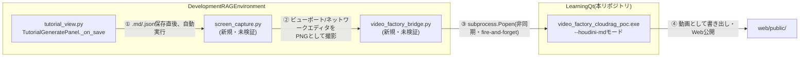
```mermaid
flowchart LR
    subgraph rag["DevelopmentRAGEnvironment"]
        TV["tutorial_view.py<br/>TutorialGeneratePanel._on_save"]
        SC["screen_capture.py<br/>(新規・未検証)"]
        VB["video_factory_bridge.py<br/>(新規・未検証)"]
    end
    subgraph engine["LearningQt(本リポジトリ)"]
        VF["video_factory_cloudrag_poc.exe<br/>--houdini-mdモード"]
    end

    TV -- "① .md/.json保存直後、自動実行" --> SC
    SC -- "② ビューポート/ネットワークエディタを<br/>PNGとして撮影" --> VB
    VB -- "③ subprocess.Popen(非同期・fire-and-forget)" --> VF
    VF -- "④ 動画として書き出し・Web公開" --> web["web/public/"]
```

- **呼び出し方式**: `tutorial_view.py::_on_save`(保存ボタン押下時)から`video_factory_bridge.py::launch_video_generation()`を呼び、`subprocess.Popen`で非同期起動(`rag_chatbot.py`のRAG local bridge起動と同じ house style: stdout/stderrをDEVNULLへ、完了は待たない)
- **起動タイミング**: チュートリアル保存直後に自動実行(ユーザー操作不要)
- **画面取得方法**: Houdini自身が`hou.SceneViewer.flipbook()`(ビューポート)と、ネットワークエディタペインのQtウィジェット`grab()`(ネットワークエディタ)でPNGを撮影し、ファイルとして`video_factory_cloudrag_poc.exe`に渡す(LearningQt側がHoudiniを外部操作するアプローチは採らなかった)

### 15.2 LearningQt側: `--houdini-md`取り込みモード

`engine/src/main_cloudrag.cpp`に追加した新しいCLIモード。Cloud RAGへ新規クエリを投げる代わりに、`tutorial_agent.py`が既に生成済みのチュートリアルをそのまま動画化する。

```
video_factory_cloudrag_poc.exe --houdini-md <tutorial.md> [--houdini-json <tutorial.json>] [--houdini-viewport <viewport.png>] [--houdini-network <network.png>]
```

処理内容:
1. `loadHoudiniTutorialMarkdown()` — YAMLフロントマター(`title`/`status`/`tags`等)を除去し、`title`をスライドの`topic`として使う
2. `summarizeHoudiniNodeGraph()` — 付属のNodeGraphAsset `.json`から**トップレベルノードのみ**(`id`のスラッシュ数が1、例: `geo1/terrain_grid`)を抽出し、短い要約文字列に変換
3. `replaceNodeConfigSection()` — 生成済みMarkdownの`## コード・ノード構成`セクションを②の要約に置き換える(理由は§15.3)
4. `assignHoudiniScreenImages()` — スライド見出しが「概要」「手順」を含む場合はビューポート画像、「ノード」「コード」を含む場合はネットワークエディタ画像を、そのスライドの右パネルビジュアル(`diagramImagePath`)として割り当てる。既存の`enrichSlidesForDisplay()`より前に実行することで、これらのスライドはスライド単位のMermaid図解生成をスキップし、実スクリーンショットを優先する
5. 以降は既存パイプライン(スライド分割・ナレーション合成・レンダリング・Web自動公開)を無変更で流用

`--houdini-json`から読んだトップレベルノード名は、図解+コード説明follow-upクエリのプロンプトにも追記され(「md・jsonの内容も取得してさらに説明補足する」というユーザー要望に対応)、ナレーションがノード名を踏まえた説明になるようにしている。

### 15.3 重要な発見: `## コード・ノード構成`セクションの無害化が必須だった

実装中、実際に保存されたチュートリアル(`procedural-rock-scatter-on-terrain_20260722.md`)で検証したところ、`tutorial_agent.py`が生成する`## コード・ノード構成`セクションが**ファイル全体1635行中1562行**を占める巨大なノード列挙(VOP内部のVEXコードスニペットを含む、深くネストした内部ノードまで再帰的に列挙したもの)であることが判明した。

これをそのままナレーション/スライド分割パイプラインに通すと、`splitLongTextSlides`が生のVEXコードを段落境界で無秩序に分割し、TTSがコードをそのまま日本語プロセとして読み上げようとし、動画の尺が非現実的に膨張する — という重大な破綻が起きることが分かった(§9で修正した「実データで発覚したバグ」と同種の、事前の`--mock`テストでは表面化しない問題)。

`replaceNodeConfigSection()`で該当セクションの本文を上記②の短い要約に差し替えることで解決した。実データ(`procedural-rock-scatter-on-terrain_20260722.md`, 1635行)での検証結果:

| 項目 | 対処前(想定) | 対処後(実測) |
|---|---|---|
| Cloud RAG answer相当の文字数 | 数万文字規模 | 2,744文字 |
| スライド数 | 極端に多い/破綻 | 21枚 |
| ノード要約 | (VOP内部含む200+ノード) | トップレベル7ノードのみ |

### 15.4 Houdini側の実装(未検証)

新規ファイル(`DevelopmentRAGEnvironment/houdini/python_panels/`):

- **`screen_capture.py`**: `capture_viewport()`(`hou.SceneViewer.flipbook()`ベース、現在フレーム1枚のみのフリップブック書き出し)、`capture_network_editor()`(`hou.paneTabOfType(hou.paneTabType.NetworkEditor)`のQtウィジェットを`grab()`するフォールバック実装)、`focus_network_on()`(撮影前にサンドボックスへネットワークエディタをフォーカス)
- **`video_factory_bridge.py`**: `launch_video_generation()` — スクリーンショット撮影 → `video_factory_cloudrag_poc.exe`を`--houdini-md`等付きで非同期起動。全段階ベストエフォート(失敗してもチュートリアル保存自体は失敗させない)
- **`tutorial_view.py`**: `TutorialGeneratePanel._on_save()`の末尾(ファイル書き込み成功後)に上記の呼び出しを追加
- **`rag_chatbot.py`**: 設定に`video_factory_exe_path`キーを追加(Settingsタブに入力欄も追加)。未設定ならスキップするだけで既存動作に影響しない

**この開発環境にはHoudini実機が無く、`hou`モジュールに依存するコードは一切実行できていない。** 特に以下は要検証:

- `hou.FlipbookSettings`のAPI(`frameRange`/`output`/`outputToMPlay`/`resolution`)がHoudini 21.0.700で実際にこの通り呼び出せるか
- `hou.PaneTab`(`NetworkEditor`)に`qtWidget()`が存在するか — 存在しない場合、Python Shellで`dir(hou.ui.paneTabOfType(hou.paneTabType.NetworkEditor))`を実行し、実際に使えるメソッド名で`screen_capture.py`を修正する必要がある
- `subprocess.Popen`でexeへ渡す引数の日本語パス(チュートリアルのタイトル等はASCIIのファイル名になるはずだが、`Path`オブジェクトの文字列化がWindows上で問題なく機能するか)

いずれも失敗時は例外を投げず`False`/ログメッセージを返すだけの設計にしてあるため、動かなくてもチュートリアル生成・保存自体への影響はない。

---

## 16. トークン消費量の可視化(推定)

2026-07-24実装。Webダッシュボードに、動画生成で消費した「トークン量」を可視化する機能を追加した。

### 16.1 背景: なぜ「推定」なのか

Cloud RAGのGAS バックエンド(`gas_cloud_rag.js`)は`recordTokenUsage_()`で実際のトークン使用量をサーバー側の内部集計シート(`RAG_TokenUsage`)に記録しているが、**クエリのレスポンスにはその数値を一切含めていない**(`{ answer, sources, extractionRate, extractionDetail }`のみを返す)。この挙動を変える(レスポンスにトークン数を追加する)には、Unity/Houdiniクライアントも共有するGAS側の変更が必要になり、今回はスコープ外とした(このリポジトリ単独で完結させる既存方針を継続)。

そのため、実測値ではなく**クエリ・応答の文字数から概算した推定値**を代わりに使う設計にした。

### 16.2 推定ロジック(`engine/src/main_cloudrag.cpp`)

```cpp
// 日本語混在テキストのGemini系トークナイザでは、概ね1.8文字/トークン程度が妥当な目安
int estimateTokens(const QString& text) {
    return static_cast<int>(std::round(text.size() / 1.8));
}
```

動画1本あたりの推定値は、以下を合算して算出する:

| クエリ | 加算対象 |
|---|---|
| メインクエリ | `topic` + `response.answer`(Houdiniチュートリアル取り込みモードでは0) |
| 図解+コード説明follow-up | `captionPrompt` + `captionResponse.answer` |
| スライド単位の図解follow-up(`enrichSlidesForDisplay`が返り値として合算値を返すよう変更) | 各スライドの`prompt` + `diagResp.answer` |

合計値は`ManifestEntryInfo::estimatedTokens`経由で`manifest.json`(`estimated_tokens`)と各動画の`metadata.json`(同名フィールド)の両方に書き込まれる(§10.2参照)。

### 16.3 Webダッシュボードでの表示

`web/public/app.js`に共通ヘルパー`tokenConsumptionHTML(manifest, { single })`を追加し、2箇所で再利用している:

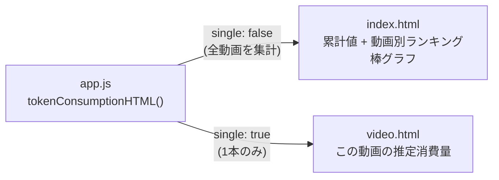
```mermaid
flowchart LR
    APP["app.js<br/>tokenConsumptionHTML()"] -->|"single: false<br/>(全動画を集計)"| IDX["index.html<br/>累計値 + 動画別ランキング棒グラフ"]
    APP -->|"single: true<br/>(1本のみ)"| DET["video.html<br/>この動画の推定消費量"]
```

- **index.html(ギャラリー)**: 累計推定トークン消費量(大きな数値)+ 推定消費量が多い順に最大8本を横棒グラフでランキング表示。棒の色はパイプラインカードと同じ既存パレット(オレンジ/ミント/ブルー等)を巡回させる
- **video.html(詳細)**: 該当動画1本分の推定消費量のみを表示(`single: true`。1件だけをランキング表示しても意味がないため、集計モードとは別の簡易表示に分岐させている)
- どちらの表示にも「RAGへのクエリ・応答の文字数から概算した推定値です(実測のAPIトークン数ではありません)」という注記を常に併記
- `estimated_tokens`フィールドが無い(=この機能追加より前に生成された)動画は自動的に集計から除外される(`v.estimated_tokens > 0`でフィルタ)ため、後方互換性の問題は無い

### 16.4 検証方法

`--mock`で動画を再生成し、`manifest.json`/`videos/<id>/metadata.json`の両方に`estimated_tokens`が書き込まれることを確認。Webダッシュボードの実ブラウザでの見た目はこのセッションではChrome拡張が使えず確認できなかったため、Node.jsで`app.js`を`eval`し、実際の`manifest.json`を渡して`tokenConsumptionHTML()`の出力HTMLを直接検証した(構文・データの反映を確認済み、実ブラウザでのレイアウト崩れの有無は未確認)。

---

## 17. DevelopmentRAGEnvironment側の変化に追従した改善

2026-07-24実装。サブエージェントで`DevelopmentRAGEnvironment`の最新状態を調査し、リポジトリを跨いで生じていた食い違いを2件修正した。

### 17.1 調査で判明したこと

- `gas_cloud_rag.js`のクエリレスポンスは`{ answer, sources, extractionRate, extractionDetail, status, allowedNamespaces, memoryId }`という構成で、**`extractionRate`(出典網羅率, 0-100)と`extractionDetail`(「5/8」形式の内訳)は以前から返されていたが、LearningQt側は一度もパースしていなかった**
- AXTechCare由来の改善(`e0ab7e9`)により、APIキー単位のトークン予算とレート制限が本番導入され、`doPost`が通常運用でも`status: "quota_exceeded"`/`status: "rate_limited"`を返しうるようになっていた。LearningQt側は非`"ok"`を一律の汎用エラーとして投げるだけで、原因の切り分けができなかった
- Houdini連携用に追加した`screen_capture.py`/`video_factory_bridge.py`/`tutorial_view.py`は、コミット後に誰にも触られておらず、**Houdini実機での検証は依然として未実施**(§15.4の状況から変化なし)
- `houdini_tools.py::export_node_graph`のNodeGraphAssetスキーマ、`tutorial_agent.py`の`## コード・ノード構成`巨大ダンプ問題(§15.3)も未変更 — 既存のサニタイズ処理(`replaceNodeConfigSection`)は引き続き必要

### 17.2 修正: `extractionRate`/`extractionDetail`の取り込み

`CloudRagResponse`に`extractionRate`(double)・`extractionDetail`(QString)を追加し、`CloudRagClient::query()`でパースするよう修正(`engine/src/ragclient/cloud_rag_client.{h,cpp}`)。`ManifestVideoDetail`経由で`metadata.json`の`quality.extraction_rate`/`quality.extraction_detail`に書き込み、`video.html`の「RAG出典」パネル上部に「出典網羅率: NN% (cited/total)」バッジとして表示する(`app.js`の`extractionBadgeHTML()`)。

値が0(`--mock`やHoudiniチュートリアル取り込みモードなど、実クエリを呼ばない経路)の場合はバッジ自体を描画しない。

### 17.3 修正: `quota_exceeded`/`rate_limited`の専用エラーメッセージ

`CloudRagClient::query()`のステータス判定に2分岐を追加:

```cpp
if (status == "quota_exceeded") {
    throw std::runtime_error(
        "Cloud RAG returned status=quota_exceeded: this API key has used up its "
        "per-key token budget. Ask an admin to recharge it via the GAS admin "
        "panel's token-budget control.");
}
if (status == "rate_limited") {
    throw std::runtime_error(
        "Cloud RAG returned status=rate_limited: too many requests in a short "
        "window. Wait a bit before retrying.");
}
```

これにより、「URLやAPIキーが間違っている」ケースと「予算切れ/レート制限」ケースがログメッセージで区別できるようになった。

### 17.4 検証方法

`--mock`で再ビルド・再生成し、コンパイルエラーが無いこと、`metadata.json`の`quality.extraction_rate`/`extraction_detail`が(実クエリを呼ばないため)`0`/空文字で書き込まれることを確認。`extractionBadgeHTML()`はNode.jsで実データ・ゼロ値・`undefined`の3パターンを直接実行し、それぞれ想定通りのHTML(またはバッジ非表示)になることを確認した。`quota_exceeded`/`rate_limited`分岐は、このセッションにCloud RAG認証情報が無く実際にそれらのステータスを再現できなかったため、コードレビューレベルの確認に留まる。

---

## 18. RAGReelランチャー(非エンジニア向けGUI)

2026-08-12実装。`video_factory_cloudrag_poc.exe`はCLIバッチツールで、非エンジニアには「環境変数を設定してコマンドライン引数を組み立てて実行する」というハードルがある。`RAGReel.exe`はそのハードルを取り除くQt Quick製のGUIフロントエンドで、内部的には`video_factory_cloudrag_poc.exe`をサブプロセスとして起動するだけの薄いラッパー。

### 18.1 画面構成

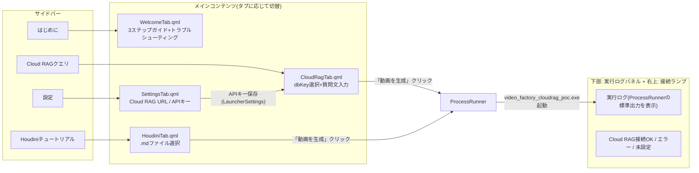
```mermaid
flowchart LR
    subgraph sidebar["サイドバー"]
        T0["はじめに"]
        T1["設定"]
        T2["Cloud RAGクエリ"]
        T3["Houdiniチュートリアル"]
    end
    subgraph main["メインコンテンツ(タブに応じて切替)"]
        W["WelcomeTab.qml<br/>3ステップガイド+トラブルシューティング"]
        S["SettingsTab.qml<br/>Cloud RAG URL / APIキー"]
        C["CloudRagTab.qml<br/>dbKey選択+質問文入力"]
        H["HoudiniTab.qml<br/>.mdファイル選択"]
    end
    subgraph bottom["下部: 実行ログパネル + 右上: 接続ランプ"]
        LOG["実行ログ(ProcessRunnerの標準出力を表示)"]
        LAMP["Cloud RAG接続OK / エラー / 未設定"]
    end
    T0 --> W
    T1 --> S
    T2 --> C
    T3 --> H
    S -- "APIキー保存(LauncherSettings)" --> C
    C -- "「動画を生成」クリック" --> PR["ProcessRunner"]
    H -- "「動画を生成」クリック" --> PR
    PR -- "video_factory_cloudrag_poc.exe起動" --> LOG
```

| タブ | ファイル | 役割 |
|---|---|---|
| はじめに | `engine/qml/WelcomeTab.qml` | 初回起動時のデフォルト表示。3ステップの使い方ガイド+トラブルシューティング欄(§19.1) |
| 設定 | `engine/qml/SettingsTab.qml` | `CLOUD_RAG_URL`/APIキーの入力・保存(`LauncherSettings`が永続化) |
| Cloud RAGクエリ | `engine/qml/CloudRagTab.qml` | 質問文+dbKeyから動画生成。`NamespaceLister`がAPIキーで利用可能なdbKey候補を取得して表示 |
| Houdiniチュートリアル | `engine/qml/HoudiniTab.qml` | Houdiniで生成済みの`.md`ファイルを選んで動画生成(同名の`.json`/`_screenshots.json`は自動的に使われる) |

### 18.2 バックエンド構成

- `main_launcher.cpp`: エントリポイント。`Launcher.qml`をロードし、`processRunner`/`namespaceLister`/`launcherSettings`/`nativeDialogs`をQMLコンテキストへ公開
- `engine/src/launcher/process_runner.{h,cpp}`: `video_factory_cloudrag_poc.exe`をQProcessでサブプロセス起動し、標準出力を1行ずつQMLへシグナルで転送
- `engine/src/launcher/namespace_lister.{h,cpp}`: `CloudRagClient::listAllowedNamespaces()`(トークン消費ゼロの権限チェックのみの呼び出し)でdbKey候補を取得
- `engine/src/launcher/launcher_settings.{h,cpp}`: `QSettings`ベースでAPIキー等を永続化
- `engine/src/launcher/native_dialogs.{h,cpp}`: `QFileDialog`によるネイティブファイル選択(Houdiniタブの`.md`選択)

### 18.3 配布

`installer/ragreel.iss`(Inno Setup)で単体インストーラをビルドできる。各インストール先は独自の`output/`フォルダにローカルダッシュボードを持つ(「RAGReel配布」方針、§2参照) — 共有Webサーバーへの集約は行わない。

---

## 19. Houdiniチュートリアル動画の品質改善4点

2026-08-12〜14、ユーザーから提示された4件の指摘への対応。

### 19.1 初心者向けセクションの不足

**指摘:** GUI操作版(RAGReel)に基本的な使い方の説明が無く、初めて触る人には何をすればいいか分からない。

**対応:** `WelcomeTab.qml`を新設し、サイドバーの先頭(デフォルト表示)に配置(§18.1)。3ステップガイド(①設定タブでAPIキー入力→②生成方法を選ぶ→③実行)と「困ったときは」ボックス(接続ランプの意味、生成に数分かかる旨、キャンセル方法)を掲載。

### 19.2 スクリーンショットがNetworkEditorではなくPython Panel Editorになる

**指摘:** Houdiniステップのスライドに表示される画面キャプチャが、意図したNetworkEditor(ノードグラフ)ではなく、エージェント自身のPython Panel(Chat/Graph/...タブのUI)になっている。

**原因:** `DevelopmentRAGEnvironment/houdini/python_panels/screen_capture.py`の`capture_network_editor()`が使っていた`network_editor.qtParentWindow()`が、ネットワークエディタペイン自身の親ウィンドウではなく、その時点でフォーカスを持つ別の最上位ウィンドウ(Python Panel自身)を返すことがあった。さらに、RAGChatBotパネルがメインウィンドウにドッキングされているレイアウトでは、ウィンドウ全体を`grab()`すると画面占有率の大きいパネル(往々にしてRAGChatBot側)が支配的に写り込んでいた。

**対応(Houdini側、`DevelopmentRAGEnvironment`リポジトリ):** `hou.qt.mainWindow()`(Houdini公式APIで本体メインウィンドウを一意に返す)に切り替えたうえで、`_find_network_editor_widget()`でメインウィンドウ配下からNetworkEditorペイン単体に相当する子ウィジェットを探索し、見つかればそれだけを`grab()`する方式に修正。**この修正は、本セッションと並行して動いていた別のClaude Codeセッションが`DevelopmentRAGEnvironment`側で実機検証まで行い、コミット済み**(コミットメッセージ: "Add beginner help tab; fix network editor capture, citation reporting, and tutorial graph layout")。LearningQt側からは変更不要。

### 19.3 「引用0」の意味が分からない/参考文献セクションが空

**指摘1:** 生成動画のナレーションで「利用率0%、引用0/2件」のような文言が唐突に流れ、何を指しているのか分からない。
**指摘2:** 「参考」セクションのスライドで、図やコードが無いため右パネルが空のグラデーションになってしまい寂しい。

**原因:** `tutorial_agent.py`が`## 参考`セクションに埋め込む研究用の生データ(`利用率: 0%（引用 0/2 件）`)が、ナレーション生成時にそのまま音声化されていた。また、参考文献の一覧(`- [1] ⬜ 未引用 タイトル（db）`)はテキストとしてしか表示されておらず、専用のビジュアルが無かった。

**対応(LearningQt側):**
- `humanizeExtractionNote()`(`engine/src/ingest/script_composer.cpp`)で、テンス(簡潔)な統計行を「参考ドキュメントはM件検索し、そのうちN件を実際にチュートリアル生成で活用しました（利用率X%）。」という完全な文に書き換えてからナレーション・スライド分割へ渡すようにした
- `parseHoudiniReferenceItems()`/`assignHoudiniReferenceItems()`で参考文献の一覧を`{title, db, cited}`の構造化データ(`Slide::referenceItems`)としてパースし、`CloudRagScene.qml`に専用の「参照した情報源」ソースカードUI(タイトル+DB名+「チュートリアルで活用」/「検索のみ・未使用」バッジ)を追加。空のグラデーションの代わりに実際のビジュアルが表示されるようになった
- **Phase 5(§20.5)のGTest導入時に判明**: `parseHoudiniReferenceItems`の正規表現が、絵文字とステータス文字列の間の半角スペース(実データの実際のフォーマット)を考慮しておらず、ステータス文字列がタイトルに混入するバグがあった。単体テストを書いたことで発覚し修正済み(詳細は§20.5)

**対応(Houdini側、並行セッションによる):** `tutorial_agent.py`で「打ち切りのため未評価」と「本当に0件引用」を区別するよう修正(「利用率: 未計測（打ち切りのため...）」という別文言に分岐)。これが「引用0」という表現の根本原因の一部でもあった。

### 19.4 対応状況まとめ

| # | 指摘 | 対応箇所 | 状態 |
|---|---|---|---|
| 1 | 初心者向けセクション不足 | LearningQt (`WelcomeTab.qml`) | ✅完了 |
| 2 | NetworkEditorキャプチャ不具合 | DevelopmentRAGEnvironment (`screen_capture.py`、並行セッション) | ✅完了(Houdini実機検証済み) |
| 3 | 「引用0」の意味不明 | LearningQt (`humanizeExtractionNote`) + DevelopmentRAGEnvironment (`tutorial_agent.py`、並行セッション) | ✅完了 |
| 4 | 参考文献セクションが空 | LearningQt (`Slide::referenceItems` + `CloudRagScene.qml`) | ✅完了(Phase 5のGTestでパースバグを追加修正) |

---

## 20. アーキテクチャ・リファクタリング(IMPROVEMENT_PLAN.md Phase 1〜5)

2026-08-14実施。`docs/architecture/video-factory-design.md`(Phase 0設計)が定義していた`Orchestrator`/`ScriptComposer`/`SceneAssembler`/`ServiceContainer`等のモジュール分割を、実際に`main_cloudrag.cpp`(当時1549行、匿名名前空間に主要ロジックが集中)から抽出した作業。詳細な経緯・当初案からの変更点・検証結果は[IMPROVEMENT_PLAN.md](../IMPROVEMENT_PLAN.md)に一次情報がある。本節はその要約。

### 20.0 着手前に判明した設計書との乖離

実装に着手する前に設計書と実装を照合したところ、8件の具体的な乖離が見つかった(いずれも実装側が理由付きで行った意図的判断であり、バグではない)。代表的なもの:

- `NarrationEngine`は設計書が想定するllama.cppではなく、実際はWindows SAPI5(§20.1で影響を詳述)
- `VectorStoreClient`(設計書はローカル`rag_local_bridge.py:8766`を想定)の実装は、実際はCloud RAG GAS WebApp向けの`CloudRagClient`
- `ManifestWriter`の公開先は共有`web/public/`ではなく、インストール先ごとのローカル`output/`(§18.3)
- 依存関係管理は「Phase 0/1で決定」ではなく、実際には`vcpkg.json`マニフェストモードで既に確定・運用中
- 設計書が知らない第三の入力経路として、Houdiniチュートリアル取り込みモード(`--houdini-md`)が既に実装の中心になっている

全件は`IMPROVEMENT_PLAN.md`の「設計書との乖離」表、および`docs/architecture/video-factory-design.md`§17を参照。

### 20.1 Phase 1: Orchestrator / ResourceBudgetManager

VRAM 8GB(RTX 3070)環境での GPU競合を防ぐため、`NarrationEngine`と`SceneAssembler`が同時にGPUを保持しないことを保証する排他リース機構。

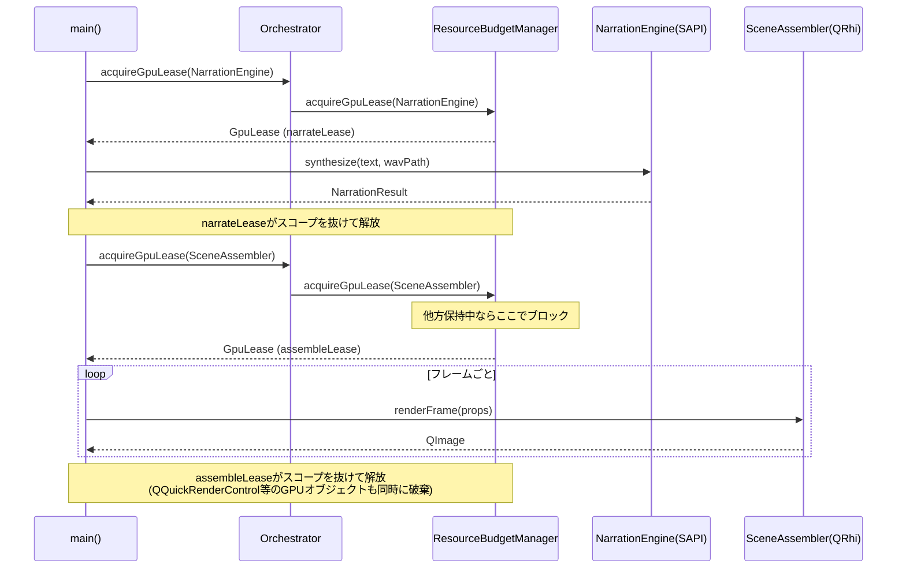
```mermaid
sequenceDiagram
    participant Main as main()
    participant Orch as Orchestrator
    participant RBM as ResourceBudgetManager
    participant NE as NarrationEngine(SAPI)
    participant SA as SceneAssembler(QRhi)

    Main->>Orch: acquireGpuLease(NarrationEngine)
    Orch->>RBM: acquireGpuLease(NarrationEngine)
    RBM-->>Main: GpuLease (narrateLease)
    Main->>NE: synthesize(text, wavPath)
    NE-->>Main: NarrationResult
    Note over Main,RBM: narrateLeaseがスコープを抜けて解放
    Main->>Orch: acquireGpuLease(SceneAssembler)
    Orch->>RBM: acquireGpuLease(SceneAssembler)
    Note over RBM: 他方保持中ならここでブロック
    RBM-->>Main: GpuLease (assembleLease)
    loop フレームごと
        Main->>SA: renderFrame(props)
        SA-->>Main: QImage
    end
    Note over Main,RBM: assembleLeaseがスコープを抜けて解放<br/>(QQuickRenderControl等のGPUオブジェクトも同時に破棄)
```

**実測(nvidia-smi、Final Phase検証):** ベースラインVRAM 2361MiB → レンダリング中2379MiB → プロセス終了後2363MiB。リークなしを確認。

**重要な注記:** 現行の`NarrationEngine`はWindows SAPI5でGPUに一切触れないため、このリース機構は**現時点では実害のあるクラッシュを防いでいない**。将来`NarrationEngine`がllama.cpp GPU推論に切り替わった時点で初めて意味を持つ、先行実装。

単体テスト(`engine/tests/resource_budget_manager_test.cpp`、フレームワーク不使用)で2スレッドを競合させ、同時保持数が1を超えないことを検証済み。

### 20.2 Phase 2: ScriptComposer + アーキタイプECS(ShotList)

`main_cloudrag.cpp`の匿名名前空間にあった約700行(`Slide`/`HoudiniTutorial`/`HoudiniStepScreenshot`構造体+スライド分割・Houdini markdown解析・参考文献パース関連の全関数)を`engine/src/ingest/script_composer.{h,cpp}`へ抽出。


```mermaid
flowchart LR
    MD["Markdown回答<br/>(Cloud RAG or Houdiniチュートリアル)"] --> SI["splitIntoSlides()"]
    SI --> ED["expandDiagramSlides()<br/>Mermaid図をPNG化"]
    ED --> SL["splitLongTextSlides()<br/>長文の強制再分割"]
    SL --> ES["enrichSlidesForDisplay()<br/>箇条書き抽出+per-slide図解request"]
    ES --> SLIDES["std::vector&lt;Slide&gt;"]
    SLIDES --> TSL["toShotList()"]
    TSL --> SHOTS["ShotList(archetype-ECS)"]

    subgraph shots["ShotKind(実装済み6種)"]
        K1["TextDigest"]
        K2["DiagramImage"]
        K3["CodeBlock"]
        K4["HoudiniStepStill"]
        K5["HoudiniStepClip"]
        K6["ReferenceCards"]
    end
    SHOTS -.-> shots
```

設計書原案の`ShotKind`は3種(タイトルカード/ノードグラフ段階リビール/出典カード)だったが、実装済み`Slide`が実際に持つバリエーションに合わせて6種で再設計した(原案の3種は現行コードに存在せず、逆にビューポートクリップ・参考文献カードは原案に無いまま本番稼働していたため)。`toShotList()`は実チュートリアル(57スライド)で「7 text / 1 diagram / 0 code / 37 houdini-still / 11 houdini-clip / 1 reference-cards」への正しい分類を確認済み。ただし`SceneAssembler`は引き続き`Slide`から直接レンダリングしており、`ShotList`はまだ描画に使われていない(§14参照)。

`IngestWatcher`(`localRAG/tutorials/`をポーリングする設計)は実装しなかった: 現行の2つの起動経路(Cloud RAGクエリはファイル入力なし、Houdini取り込みは`--houdini-md`で明示的にパスを渡すプッシュ型)のどちらもポーリングモデルと合わず、呼び出し元が存在しないため。

### 20.3 Phase 3: SceneAssembler

`QQuickRenderControl`/`QQuickWindow`/`QQmlEngine`/`QQmlComponent`+QRhiテクスチャ・レンダーターゲット一式の所有権を`engine/src/scene/scene_assembler.{h,cpp}`の`SceneAssembler`クラスへ集約。

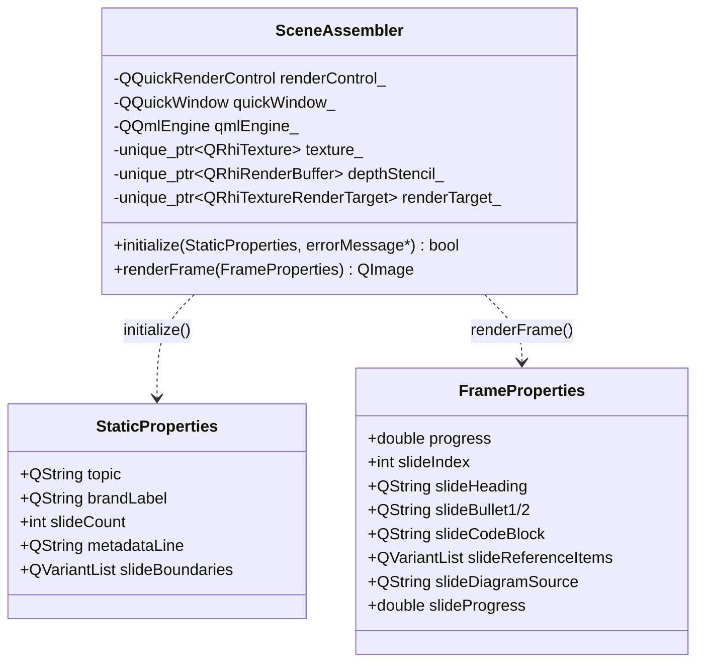
```mermaid
classDiagram
    class SceneAssembler {
        -QQuickRenderControl renderControl_
        -QQuickWindow quickWindow_
        -QQmlEngine qmlEngine_
        -unique_ptr~QRhiTexture~ texture_
        -unique_ptr~QRhiRenderBuffer~ depthStencil_
        -unique_ptr~QRhiTextureRenderTarget~ renderTarget_
        +initialize(StaticProperties, errorMessage*) bool
        +renderFrame(FrameProperties) QImage
    }
    class StaticProperties {
        +QString topic
        +QString brandLabel
        +int slideCount
        +QString metadataLine
        +QVariantList slideBoundaries
    }
    class FrameProperties {
        +double progress
        +int slideIndex
        +QString slideHeading
        +QString slideBullet1/2
        +QString slideCodeBlock
        +QVariantList slideReferenceItems
        +QString slideDiagramSource
        +double slideProgress
    }
    SceneAssembler ..> StaticProperties : initialize()
    SceneAssembler ..> FrameProperties : renderFrame()
```

`initialize()`/`renderFrame()`の2メソッドのみの薄いインターフェースで、CPU側リードバック(既存実装がもともとこの方式だったため変更なし)。設計書原案の「`ShotList`をQML側のモデルデータとしてバインドする」は実装しなかった——既存の`CloudRagScene.qml`のフラットなper-frameプロパティ契約が実証済みに動いており、これを全面的に書き換えるのは本フェーズの本来のゴール(`QQuickRenderControl`等をクラス境界に閉じ込めること)を超えるリスクのため。生成動画のサムネイルを抽出前後で目視比較し、レイアウト・テキスト・画像が同一であることを確認済み。

### 20.4 Phase 4: ServiceContainer(DI)

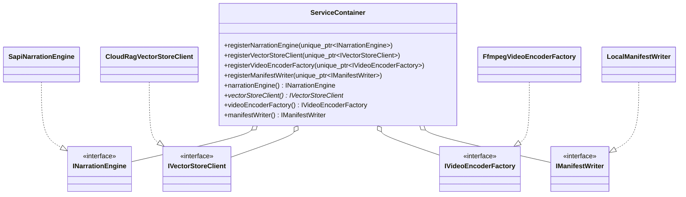
```mermaid
classDiagram
    class ServiceContainer {
        +registerNarrationEngine(unique_ptr~INarrationEngine~)
        +registerVectorStoreClient(unique_ptr~IVectorStoreClient~)
        +registerVideoEncoderFactory(unique_ptr~IVideoEncoderFactory~)
        +registerManifestWriter(unique_ptr~IManifestWriter~)
        +narrationEngine() INarrationEngine
        +vectorStoreClient() IVectorStoreClient*
        +videoEncoderFactory() IVideoEncoderFactory
        +manifestWriter() IManifestWriter
    }
    class INarrationEngine { <<interface>> }
    class IVectorStoreClient { <<interface>> }
    class IVideoEncoderFactory { <<interface>> }
    class IManifestWriter { <<interface>> }
    class SapiNarrationEngine
    class CloudRagVectorStoreClient
    class FfmpegVideoEncoderFactory
    class LocalManifestWriter

    SapiNarrationEngine ..|> INarrationEngine
    CloudRagVectorStoreClient ..|> IVectorStoreClient
    FfmpegVideoEncoderFactory ..|> IVideoEncoderFactory
    LocalManifestWriter ..|> IManifestWriter
    ServiceContainer o-- INarrationEngine
    ServiceContainer o-- IVectorStoreClient
    ServiceContainer o-- IVideoEncoderFactory
    ServiceContainer o-- IManifestWriter
```

`engine/src/services/`に4つのインターフェース(`interfaces.h`)+既存モジュールをそのまま呼ぶだけの薄いアダプタ(`concrete_services.h`)+単純なレジストリ(`service_container.h`)を新設。`main()`冒頭で`ServiceContainer`を組み立て、以降`NarrationEngine::synthesize()`/`CloudRagClient::fromEnvironment()`(複数箇所に散らばっていた)/`VideoEncoder`直接構築/`ManifestWriter::publish()`の呼び出しを全て`services.xxx()`経由に置き換えた。

`IVideoEncoder`は設計書原案通りの「1回登録して使い回す単一インスタンス」ではなく`IVideoEncoderFactory`にした——`VideoEncoder`のコンストラクタはジョブ固有パラメータ(出力パス・音声パス)を取るため、ナレーション合成が終わるまで構築できない。`Orchestrator`(§20.1)のコンストラクタはこれらのインターフェースを受け取っていない——`Orchestrator`はGPUリースとステージ記録のみを担当し、モジュール呼び出し自体は`main()`が直接行う設計を維持したため。

### 20.5 Phase 5: GTestスイート + CI

`vcpkg.json`に`gtest`を追加(既存の`qtbase`/`qtdeclarative`/`ffmpeg`と同じvcpkgマニフェスト経路。CMake FetchContent等は新たに導入していない)。`engine/tests/script_composer_test.cpp`に9件のGTestケース(`splitIntoSlides`/`stripCitationMarkers`/`humanizeExtractionNote`/`assignHoudiniReferenceItems`/`splitLongTextSlides`の参考文献カード除外/`toShotList`の分類・順序)を追加。

**このテストが実際にバグを1件発見した**: `parseHoudiniReferenceItems`の正規表現が、絵文字とステータス文字列の間の半角スペースを想定しておらず、ステータス文字列がタイトルに混入していた(§19.3参照)。このコードはPhase 0着手より前のセッション前半で書かれ、実チュートリアルでの動作確認時はたまたま別のスライドのサムネイルしか目視していなかったため見逃されていた。テストを書いて初めて発覚・修正した——静的解析導入(Phase 5)自体の価値を裏付ける実例。

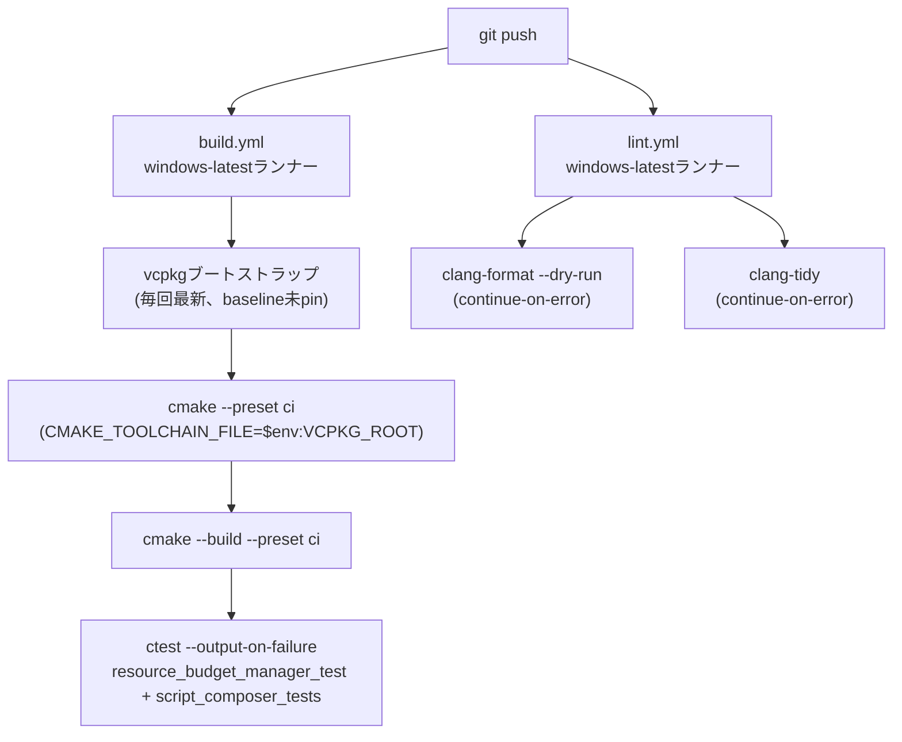
```mermaid
flowchart TB
    PUSH["git push"] --> BUILD["build.yml<br/>windows-latestランナー"]
    PUSH --> LINT["lint.yml<br/>windows-latestランナー"]
    BUILD --> VCPKG1["vcpkgブートストラップ<br/>(毎回最新、baseline未pin)"]
    VCPKG1 --> CFG1["cmake --preset ci<br/>(CMAKE_TOOLCHAIN_FILE=$env:VCPKG_ROOT)"]
    CFG1 --> BLD["cmake --build --preset ci"]
    BLD --> TEST["ctest --output-on-failure<br/>resource_budget_manager_test + script_composer_tests"]
    LINT --> FMT["clang-format --dry-run<br/>(continue-on-error)"]
    LINT --> TIDY["clang-tidy<br/>(continue-on-error)"]
```

`CMakePresets.json`に`ci`プリセットを新設(`default`を継承し`CMAKE_TOOLCHAIN_FILE`のみ`$env{VCPKG_ROOT}`ベースへ変更。ローカル開発機用の`default`は無変更)。`.clang-format`/`.clang-tidy`も新設したが、このセッションの環境にclang-format/clang-tidyバイナリが無く一度も実行できていないため、`lint.yml`は`continue-on-error: true`にして初回実行がPRを赤くしないようにしてある。**CI初回のグリーン実行はこのセッション終了時点で未確認**(push後`gh run list`で起動を確認したが、Qtをソースからビルドするため長時間かかり結果待ち)。

### 20.6 Final Phase: 統合検証結果

- `main_cloudrag.cpp`と同一入力(`--mock`/`--mock-plain`/実Houdiniチュートリアル)で、リファクタ後も同一の`.mp4`+`metadata.json`が生成されることを各フェーズで反復確認
- VRAM実測(§20.1参照)でリークなしを確認
- `docs/architecture/video-factory-design.md`§7のリポジトリ構成案の7ディレクトリ全てが実装済み。加えて設計書にない`common/`/`services/`/`launcher/`が存在(§20.0の乖離)
- `metadata.json`の`pipeline`配列を`orchestrator.stageResults()`から構築するよう変更(以前は独立した手書きリストで実行結果と乖離しうる状態だった)。ingest/compose/narrate/assemble/render/publishの6エントリ(設計書の7フェーズ中、`encode`は`render`の計測に含まれるため独立していない)が正しい順序・ラベル・所要時間で出力されることを確認
